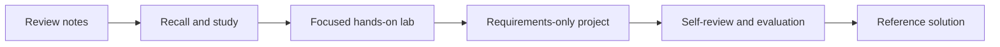

# Enterprise AI Integration Labs

A learner-first technical training repository for building, securing, evaluating, and troubleshooting modern AI systems.

The curriculum moves from model APIs and tool contracts into real MCP integrations, agent reliability, retrieval systems, and multi-service operations. Every topic is taught through review notes, focused labs, project requirements, and separately stored reference solutions.

## Start Here

Choose the path that matches what you want to do:

| Goal | Start here |
| --- | --- |
| Learn or review a concept | [Review Notes](review-notes/README.md) |
| Practice with guided exercises | [Hands-on Labs](labs/README.md) |
| Test recall and identify weak areas | [Study Lab](study/README.md) |
| Build a portfolio-scale system | [Project Requirements](projects/README.md) |
| Compare after completing a project | [Reference Solutions](solutions/README.md) |
| Follow the recommended sequence | [Learning Path](LEARNING_PATH.md) |
| Verify Labs 1–5 locally | [Testing Guide](TESTING.md) |

Open the browser-based study application at [study/index.html](study/index.html). It runs without a backend and stores progress only in the local browser.

## Learning Model

Each module follows the same progression:



The `projects/` directory contains requirements, acceptance criteria, architecture constraints, and evaluation rubrics. It intentionally does not contain implementation code. Reference implementations live under `solutions/` so learners can work independently before comparing approaches.

## Curriculum Map

| Module | Concepts | Applied outcome |
| --- | --- | --- |
| Model application foundations | Responses, structured outputs, streaming, retries, error handling | A reliable model gateway |
| Tool contracts | Function tools, schemas, validation, idempotency | Safe application-owned tools |
| MCP integration | Discovery, Streamable HTTP, resources, authentication, scopes | A real remote MCP server |
| Agent runtime | State, approvals, guardrails, traces, recovery | An inspectable tool-using workflow |
| Retrieval systems | Ingestion, embeddings, hybrid search, access control, citations | A tenant-aware RAG service |
| Evaluation | Datasets, deterministic checks, graders, trace review | Repeatable quality gates |
| Operations | Containers, health checks, telemetry, fault injection | A workshop-ready multi-service system |

## Capstone Projects

1. [Engineering Operations MCP](projects/project-01-engineering-operations-mcp.md) — connect a remote MCP server to a real GitHub sandbox with scoped read and approval-gated write tools.
2. [Reliable Agent Runtime](projects/project-02-reliable-agent-runtime.md) — build a model-driven workflow with durable state, guardrails, approvals, traces, and behavioral evaluations.
3. [Tenant-Aware RAG Platform](projects/project-03-tenant-aware-rag-platform.md) — implement ingestion, hybrid retrieval, authorization filters, grounded generation, citations, and retrieval evaluations.
4. [AI Lab Reliability Platform](projects/project-04-ai-lab-reliability-platform.md) — operate the curriculum as a reproducible multi-service workshop with preflight checks, reset controls, and fault injection.

## Repository Structure

```text
.
├── review-notes/   Long-form study and teaching material
├── study/          Browser practice, flashcards, and progress tracking
├── labs/           Guided exercises with checkpoints and troubleshooting
├── projects/       Requirements-only capstone specifications
├── solutions/      Reference implementations; contains spoilers
└── LEARNING_PATH.md
```

## Recommended Workflow

1. Read the applicable review note.
2. Complete the study questions without looking up the answer.
3. Perform the corresponding lab and keep a debugging log.
4. Build the project from the requirements document.
5. Run the project acceptance tests and complete the self-review rubric.
6. Only then inspect the reference solution.
7. Record where your design differs and whether the difference is intentional.

## Public Repository Boundaries

- Use public or synthetic data only.
- Never commit API keys, OAuth tokens, access codes, customer data, or private documents.
- Default all external write integrations to a sandbox environment.
- Require explicit approval before a lab performs a side effect.
- Keep recorded or mocked modes available when paid services are unavailable.
- Clearly label incomplete, simulated, and production-ready behavior.

## Current Status

Labs 1–5 now include learner starters, deterministic fixtures, progressive hints, executable reference solutions, and automated tests. The next implementation phase is Engineering Operations MCP, which will integrate these patterns with a real GitHub sandbox and durable approval workflow.
