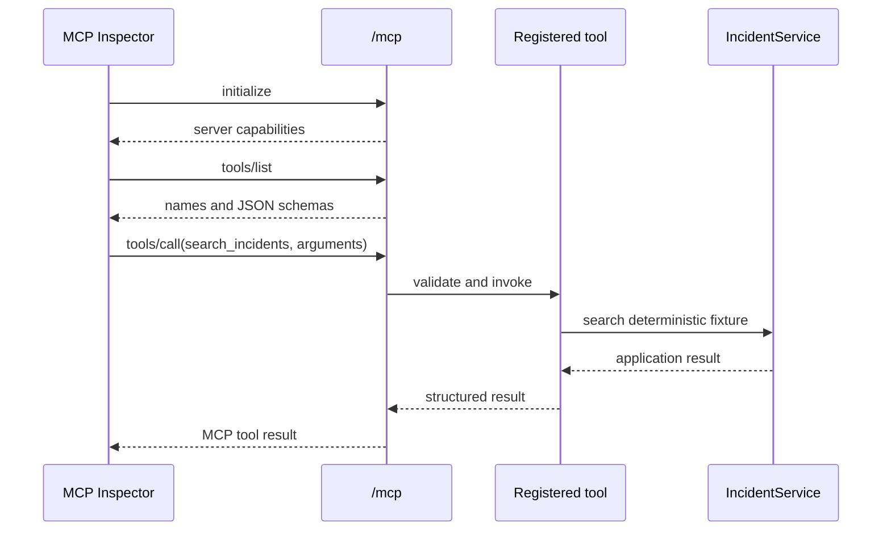
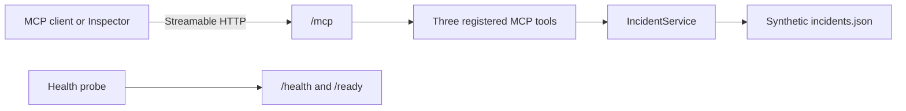

# Lab 3 — Build an MCP Server

## Objective

Turn a deterministic incident service into a discoverable Model Context Protocol (MCP) server. You will expose narrow tools over Streamable HTTP, inspect their generated schemas, validate successful and unsuccessful calls, and package the server in a container.

This is a self-guided implementation lab. Everything required for the core exercise is in this guide and the starter directory. The official documentation and an AI assistant are optional references, not prerequisites.

## Learning Outcomes

By the end of this lab, you should be able to:

- Explain the difference between an MCP tool and an HTTP endpoint.
- Register typed Python functions as MCP tools.
- Predict how Python annotations become JSON Schema.
- Describe tool behavior with accurate MCP annotations.
- Serve MCP over stateless Streamable HTTP.
- Keep operational health endpoints outside the MCP protocol surface.
- Use MCP Inspector to discover and call tools without involving a model.
- Locate failures at the server, transport, discovery, schema, or tool-execution layer.

## Scenario

An operations team already has deterministic application functions for searching incidents, retrieving an incident, and drafting a comment proposal. Multiple AI clients need to discover and call those capabilities through a standard protocol.

Your server must expose only these three capabilities:

| Tool | Behavior | Side effect |
| --- | --- | --- |
| `search_incidents` | Search a synthetic local incident store | None |
| `get_incident` | Retrieve one synthetic incident | None |
| `draft_incident_comment` | Return a pending comment proposal | No external write |

The word **draft** matters. Lab 3 does not add comments to an incident and does not connect to a production system.

## Time and Prerequisites

**Estimated time:** 120–150 minutes for a first MCP implementation.

Before starting:

- Complete Lab 2 or review its narrow-tool design.
- Read [MCP and Tool Integration](../review-notes/02-mcp-and-tool-integration.md).
- Install Python 3.12.
- Install Node.js if you want to use the browser-based MCP Inspector. Check the [Inspector requirements](https://github.com/modelcontextprotocol/inspector#requirements) for its current supported version.
- Install Docker only if you want to complete the container milestone.

No API key or model access is required.

## Concept Briefing

### The roles in an MCP interaction

- An **MCP server** publishes capabilities such as tools, resources, and prompts.
- An **MCP client** connects to a server, initializes the protocol session, discovers capabilities, and invokes them.
- A **host** is the application containing one or more MCP clients. A model-powered application can be a host, but a model is not required to test MCP.
- A **tool** is a named, schema-described operation exposed by the server. It is not a terminal command and is not automatically a REST endpoint.

In this lab, MCP Inspector acts as the client. Your Python application is the server.

### The protocol sequence



If health succeeds but `tools/list` fails, the web process is alive but the MCP layer is not working. If discovery succeeds but one call fails, investigate the tool contract or domain call rather than network reachability.

### Why use stateless JSON Streamable HTTP?

Streamable HTTP is the remote transport used in this lab. Stateless mode avoids server-side MCP session affinity, which makes a simple server easier to scale horizontally. JSON responses are easier to inspect for short, non-streaming training operations. These settings are design decisions for this lab, not universal defaults for every MCP workload.

### Why keep health routes separate?

`/health` and `/ready` are ordinary operational HTTP endpoints. They help a container platform or operator determine whether the process is alive and its fixture loaded. They must not initialize MCP or invoke a tool.

The intended public surface is:

```text
GET  /health    process health
GET  /ready     dependency readiness
POST /mcp       MCP protocol traffic
```

## Architecture



The starter provides `IncidentService` and the synthetic fixture. Your task begins at the MCP boundary; do not rewrite the incident store.

## Requirements

1. Use the pinned MCP Python SDK rather than implementing JSON-RPC framing yourself.
2. Publish exactly the three declared tools and no generic escape-hatch capability.
3. Enforce the documented input constraints at the MCP boundary.
4. Return structured tool results and preserve the domain service’s `request_id`.
5. Describe side effects accurately with tool annotations.
6. Return controlled validation and not-found failures without exposing secrets or a client-facing Python stack trace.
7. Serve stateless JSON Streamable HTTP at `/mcp`.
8. Keep `/health` and `/ready` outside the protocol surface.
9. Run the packaged server as a non-root container user.
10. Use only the provided synthetic fixture; no credential or external service is needed.

## Starter-Code Map

Work in `labs/starters/lab-03-mcp-server/`.

| Path | Purpose | Learner work |
| --- | --- | --- |
| `lab03/server.py` | MCP registration and ASGI application | Complete the bounded `TODO` sections |
| `lab03/domain.py` | Deterministic incident operations | Read and call it; do not modify it for the core lab |
| `fixtures/incidents.json` | Synthetic incident records | Use as provided |
| `tests/test_lab03.py` | Executable acceptance criteria | Run after each milestone |
| `Dockerfile` | Container starter | Configure a non-root runtime |
| `.dockerignore` | Container build exclusions | Use as provided |
| `requirements.txt` | Container dependencies | Use as provided |

The separate implementation under `solutions/` contains spoilers. Compare it only after completing the checkpoints or after recording where you became blocked.

## Tool Contracts

Implement exactly these public inputs. Do not expose a generic database, filesystem, or HTTP tool.

### `search_incidents`

| Argument | Type | Constraints | Default |
| --- | --- | --- | --- |
| `query` | string | 1–120 characters | Required |
| `service_name` | string or null | 2–80 characters when present | `null` |
| `limit` | integer | 1–20 | `10` |

Return the dictionary produced by `service.search(query=..., service=..., limit=...)`.

Annotations:

- Read-only: yes
- Destructive: no
- Open-world interaction: no

### `get_incident`

| Argument | Type | Constraints |
| --- | --- | --- |
| `incident_id` | string | Pattern `INC-` followed by four digits |

Return `service.get(incident_id)`.

Annotations:

- Read-only: yes
- Destructive: no
- Open-world interaction: no

### `draft_incident_comment`

| Argument | Type | Constraints |
| --- | --- | --- |
| `incident_id` | string | Pattern `INC-` followed by four digits |
| `body` | string | 8–1000 characters |
| `requested_by` | string | 3–80 characters |

Return `service.draft_comment(...)`.

Annotations:

- Read-only: no, because it creates a proposal object
- Destructive: no
- Idempotent intent: yes
- Open-world interaction: no

## Essential SDK Patterns

These examples teach the unfamiliar SDK syntax using a different domain. Adapt the patterns; do not copy the example tool into your final server.

### Pattern 1: initialize FastMCP

```python
from mcp.server.fastmcp import FastMCP

example_mcp = FastMCP(
    "Inventory Training Example",
    instructions="Inspect synthetic inventory without changing it.",
    stateless_http=True,
    json_response=True,
    streamable_http_path="/",
)
```

`streamable_http_path="/"` means the MCP sub-application serves its protocol at its own root. Later, the parent ASGI application mounts that sub-application at `/mcp`.

### Pattern 2: register a constrained tool

```python
from typing import Annotated, Any

from mcp.types import ToolAnnotations
from pydantic import Field


@example_mcp.tool(
    description="Look up one synthetic inventory item.",
    annotations=ToolAnnotations(
        readOnlyHint=True,
        destructiveHint=False,
        openWorldHint=False,
    ),
    structured_output=True,
)
def get_inventory_item(
    item_id: Annotated[str, Field(pattern=r"^ITEM-\d{3}$")],
) -> dict[str, Any]:
    return {"item_id": item_id, "quantity": 4}
```

FastMCP uses the function name, description, signature, annotations, and return annotation to build the tool definition. `Field` constraints become part of the input schema and are enforced before the function body runs.

### Pattern 3: mount MCP beside health routes

```python
import contextlib

from starlette.applications import Starlette
from starlette.requests import Request
from starlette.responses import JSONResponse
from starlette.routing import Mount, Route


async def example_health(_: Request) -> JSONResponse:
    return JSONResponse({"status": "ok"})


@contextlib.asynccontextmanager
async def example_lifespan(_: Starlette):
    async with example_mcp.session_manager.run():
        yield


example_app = Starlette(
    routes=[
        Route("/health", example_health),
        Mount("/mcp", app=example_mcp.streamable_http_app()),
    ],
    lifespan=example_lifespan,
)
```

The MCP session manager must run for the lifetime of the mounted application. Your Lab 3 application also needs `/ready`.

### Pattern 4: run the ASGI application

```python
import os

import uvicorn

uvicorn.run(
    example_app,
    host=os.getenv("EXAMPLE_HOST", "127.0.0.1"),
    port=int(os.getenv("EXAMPLE_PORT", "8000")),
    log_level="info",
)
```

For the lab, read the host and port from `LAB_HOST` and `LAB_PORT`, with safe local defaults. The container will override the host with `0.0.0.0`.

### Pattern 5: use a non-root container user

```dockerfile
RUN useradd --create-home --uid 10002 exampleuser

# Copy and install the application before dropping privileges.
USER exampleuser
```

The exact user name and non-zero UID are implementation choices. `USER` must appear before the runtime command.

## Setup

Choose the commands for your shell.

### Git Bash on Windows

From the repository root:

```bash
python -m venv .venv
./.venv/Scripts/python.exe -m pip install --no-cache-dir -r requirements/labs.txt
cd labs/starters/lab-03-mcp-server
```

If `.venv` already exists and the dependencies are installed, only run the `cd` command.

### PowerShell on Windows

From the repository root:

```powershell
python -m venv .venv
.\.venv\Scripts\python.exe -m pip install --no-cache-dir -r requirements\labs.txt
Set-Location labs\starters\lab-03-mcp-server
```

## Milestone 0 — Establish the Baseline

Run the starter tests before editing anything.

Git Bash:

```bash
../../../.venv/Scripts/python.exe -m pytest -q
```

PowerShell:

```powershell
..\..\..\.venv\Scripts\python.exe -m pytest -q
```

Expected baseline: `6 failed`. The failures are intentional. They show that the transport settings, tools, structured calls, validation, and web application still need implementation. Read the first failure completely before editing.

## Milestone 1 — Configure the MCP Server

In `lab03/server.py`, complete the FastMCP constructor.

Acceptance criteria:

- The name remains `Incident Operations Lab`.
- Instructions describe the server’s complete but narrow purpose.
- `stateless_http` is enabled.
- `json_response` is enabled.
- The MCP sub-application uses `/` internally so it can be mounted cleanly at `/mcp`.

Run only the transport test while iterating:

```bash
../../../.venv/Scripts/python.exe -m pytest -q tests/test_lab03.py::test_server_uses_scalable_transport_settings
```

PowerShell uses the same test selector with the PowerShell interpreter path:

```powershell
..\..\..\.venv\Scripts\python.exe -m pytest -q tests/test_lab03.py::test_server_uses_scalable_transport_settings
```

Expected result:

```text
1 passed
```

## Milestone 2 — Register the Three Tools

Use the tool-contract tables and Pattern 2 to implement the functions in `lab03/server.py`.

For each function:

1. Use the exact public tool name.
2. Add a concise description that explains what the tool does, not when a model should pretend to call it.
3. Add accurate `ToolAnnotations`.
4. Constrain every argument with `Annotated[..., Field(...)]`.
5. Use an explicit serializable return annotation such as `dict[str, Any]`.
6. Delegate to the provided `IncidentService`; keep domain logic out of the protocol layer.

Run the discovery and invocation tests:

```bash
../../../.venv/Scripts/python.exe -m pytest -q \
  tests/test_lab03.py::test_mcp_lists_only_expected_tools \
  tests/test_lab03.py::test_mcp_tool_returns_structured_result \
  tests/test_lab03.py::test_invalid_arguments_are_rejected_by_contract \
  tests/test_lab03.py::test_missing_incident_is_controlled_tool_failure
```

In PowerShell, place the command on one line:

```powershell
..\..\..\.venv\Scripts\python.exe -m pytest -q tests/test_lab03.py::test_mcp_lists_only_expected_tools tests/test_lab03.py::test_mcp_tool_returns_structured_result tests/test_lab03.py::test_invalid_arguments_are_rejected_by_contract tests/test_lab03.py::test_missing_incident_is_controlled_tool_failure
```

Expected result:

```text
4 passed
```

Before continuing, explain why `limit=500` must fail before `IncidentService.search` is called.

## Milestone 3 — Add Operational HTTP Routes

Create:

- `GET /health`, returning a small JSON response with status `ok`.
- `GET /ready`, returning status `ready` and whether the fixture is loaded.
- An application lifespan that runs the MCP session manager.
- A Starlette application that mounts the MCP sub-application at `/mcp`.

Do not place health functions behind `@mcp.tool`. Health probes and MCP discovery solve different problems.

Run the health test:

```bash
../../../.venv/Scripts/python.exe -m pytest -q tests/test_lab03.py::test_health_is_separate_from_protocol_endpoint
```

Expected result:

```text
1 passed
```

## Milestone 4 — Run the Complete Automated Suite

```bash
../../../.venv/Scripts/python.exe -m pytest -q
```

Expected result:

```text
6 passed
```

The tests prove the local contracts. They do not yet prove that a separate client can connect over a real network socket.

## Milestone 5 — Start and Probe the Server

Complete `main()` so it runs the Starlette `app` through Uvicorn. Use:

- `LAB_HOST`, defaulting to `127.0.0.1`
- `LAB_PORT`, defaulting to `8000`

Terminal 1, from the starter directory:

```bash
../../../.venv/Scripts/python.exe -m lab03.server
```

Leave it running. The final Uvicorn line should indicate that it is listening on `http://127.0.0.1:8000`.

Terminal 2:

```bash
curl http://127.0.0.1:8000/health
curl http://127.0.0.1:8000/ready
```

PowerShell:

```powershell
curl.exe http://127.0.0.1:8000/health
curl.exe http://127.0.0.1:8000/ready
```

Expected health response includes:

```json
{"status":"ok"}
```

Expected readiness response includes:

```json
{"status":"ready","fixture_loaded":true}
```

Your response may contain an additional service name.

## Milestone 6 — Discover and Call Tools with MCP Inspector

The tools are not terminal commands. They appear in Inspector only after it connects to the MCP protocol endpoint.

First check Node:

```bash
node --version
```

Then, while the Python server remains running, start Inspector in Terminal 2:

```bash
npx -y @modelcontextprotocol/inspector
```

Open the exact token-bearing URL printed by Inspector. In the browser:

1. Select **Streamable HTTP**.
2. Enter `http://127.0.0.1:8000/mcp`.
3. Select **Connect**.
4. Open **Tools**.
5. Select **List Tools** or refresh the tool list.

Expected tools:

```text
search_incidents
get_incident
draft_incident_comment
```

### Successful search

Select `search_incidents` and enter:

```json
{
  "query": "checkout",
  "limit": 5
}
```

Expected evidence:

- `returned` is `1`.
- The first item has `incident_id` equal to `INC-1001`.
- `request_id` begins with `req_`.

### Successful retrieval

Call `get_incident` with:

```json
{
  "incident_id": "INC-1002"
}
```

The result should describe delayed invoice exports.

### Proposal-only operation

Call `draft_incident_comment` with:

```json
{
  "incident_id": "INC-1001",
  "body": "Investigating the checkout timeout increase.",
  "requested_by": "lab-learner"
}
```

Expected evidence:

- `status` is `pending`.
- A `proposal_id` and `payload_hash` are present.
- The incident fixture is unchanged.

### Contract failure

Call `search_incidents` with `limit` set to `500`. Record the error. The error should identify the upper-bound violation without exposing a Python stack trace to the client.

## Milestone 7 — Complete the Container

The provided Dockerfile is intentionally runnable but still uses the root user. Modify it to create and use a dedicated non-root user. Do not copy the repository’s virtual environment or secrets into the image.

Build from the starter directory:

```bash
docker build -t enterprise-ai-lab03 .
```

Confirm the runtime identity is not root:

```bash
docker run --rm enterprise-ai-lab03 id
```

The output must not show `uid=0(root)`.

Run the container:

```bash
docker run --rm -p 8000:8000 -e LAB_HOST=0.0.0.0 enterprise-ai-lab03
```

In another terminal:

```bash
curl http://127.0.0.1:8000/health
```

Stop the server or container with `Ctrl+C`.

## What Each Test Is Teaching

| Test | Boundary under test | Typical cause of failure |
| --- | --- | --- |
| `test_server_uses_scalable_transport_settings` | Server configuration | Stateless or JSON mode omitted |
| `test_mcp_lists_only_expected_tools` | Discovery and schemas | Missing registration, wrong name, broad constraint, or incorrect annotation |
| `test_mcp_tool_returns_structured_result` | Tool invocation | Tool does not delegate correctly or lacks structured output |
| `test_invalid_arguments_are_rejected_by_contract` | Input trust boundary | `limit` is unconstrained or validation happens too late |
| `test_missing_incident_is_controlled_tool_failure` | Domain failure propagation | Missing incident is swallowed or converted into an unrelated error |
| `test_health_is_separate_from_protocol_endpoint` | Operational HTTP surface | No ASGI app, wrong route, or health coupled to MCP |

Passing tests are necessary but not sufficient. The Inspector milestone verifies a real client connection and the container milestone verifies packaging.

## Break/Fix Challenge

Choose one failure, introduce it deliberately, and diagnose it from the outside in:

- Change the Inspector URL from `/mcp` to `/wrong`.
- Register `search_incidents` under an incorrect name.
- Remove the explicit structured return annotation.
- Change the fixture path so it fails after containerization.

Record:

1. Symptom
2. Evidence
3. First hypothesis
4. Diagnostic action
5. Root cause
6. Repair
7. Regression test or prevention

Restore the working implementation before finishing.

## Progressive Hints

<details><summary>Hint 1 — Where should I begin?</summary>

Make the transport-settings test pass first. Then implement only `search_incidents` and inspect its generated schema before adding the other two tools.
</details>

<details><summary>Hint 2 — Which imports are relevant?</summary>

The starter already imports FastMCP. Tool registration additionally needs `Annotated`, `Any`, `ToolAnnotations`, and Pydantic `Field`. The ASGI layer needs Starlette routes, responses, mounting, and a lifespan context manager.
</details>

<details><summary>Hint 3 — How does a tool call reach the fixture?</summary>

The MCP function should contain almost no business logic. Accept validated arguments, translate `service_name` to the domain method’s `service` keyword, call the corresponding `IncidentService` method, and return its dictionary.
</details>

<details><summary>Hint 4 — Why does Inspector connect but show no tools?</summary>

Verify that the decorated functions execute at module import time and that Inspector is connected to `/mcp`, not `/health` or the server root. Then run `test_mcp_lists_only_expected_tools` directly.
</details>

<details><summary>Hint 5 — How should the ASGI mount work?</summary>

Configure the MCP sub-application to use `/` internally, mount it under `/mcp` in Starlette, and run the MCP session manager inside the Starlette lifespan. This avoids accidentally producing `/mcp/mcp`.
</details>

<details><summary>Hint 6 — I am still blocked</summary>

Write one tool using the complete Pattern 2 shape, substitute the `search_incidents` contract, and call `service.search` with named arguments. Run only the discovery test, inspect the failing assertion, and change one boundary at a time.
</details>

## Troubleshooting

| Symptom | Likely layer | Diagnostic action |
| --- | --- | --- |
| `python: command not found` or Windows path is mangled | Shell command | In Git Bash use `../../../.venv/Scripts/python.exe`; in PowerShell use `..\..\..\.venv\Scripts\python.exe` |
| `No module named mcp` | Environment | Re-run the root dependency installation with the virtual-environment interpreter |
| Tests show zero tools | Registration | Confirm the functions use `@mcp.tool(...)` and are defined before the application starts |
| `/health` returns 404 | ASGI routing | Confirm Uvicorn runs the Starlette `app`, not `mcp.run(...)` |
| Inspector cannot connect but health works | MCP path or lifecycle | Confirm Streamable HTTP and the exact URL `http://127.0.0.1:8000/mcp` |
| Inspector asks for a proxy token | Inspector UI | Open the token-bearing URL printed by the `npx` process |
| Inspector fails to start | Node runtime | Compare `node --version` with the current Inspector requirement |
| Tool schema allows `limit=500` | Input schema | Confirm `Annotated[int, Field(ge=1, le=20)]` is on the public parameter |
| Server exposes `/mcp/mcp` | Mount composition | Use `/` inside the MCP sub-app and mount that app at `/mcp` |
| Container starts but fixture is missing | Packaging | Confirm the Dockerfile copies both `lab03/` and `fixtures/` |
| Docker cannot connect to its API or named pipe | Container runtime | Start Docker Desktop, wait for its engine to report healthy, and retry the container milestone |
| Port 8000 is already in use | Process/runtime | Stop the earlier server or set `LAB_PORT` to another unused port |

## Using AI During This Lab

AI is optional. Use it as a tutor or reviewer rather than as an unverified solution source. Useful prompts include:

```text
Explain what this failing test proves about the MCP boundary. Do not write the implementation.
```

```text
Review these tool annotations against the actual side effects and identify any inaccurate claims.
```

```text
Give me three hypotheses for why health succeeds while MCP initialization fails, and one diagnostic check for each.
```

If AI generates code, you are still responsible for explaining every argument constraint, confirming the generated schema in Inspector, and proving that the proposal tool performs no external write.

## Deliverables

- Completed starter source
- Passing automated tests
- Inspector evidence showing tool discovery
- One successful structured result
- One controlled validation failure
- Working non-root container
- Break/fix debugging log
- Answers to the reflection questions

## Reflection Questions

1. Why is an MCP tool different from an ordinary HTTP endpoint even though this server uses HTTP as its transport?
2. Which validation occurs before `IncidentService` runs, and why should it occur there?
3. Why is `draft_incident_comment` not marked read-only even though it performs no external write?
4. What do `destructiveHint` and `openWorldHint` communicate, and why are they not security enforcement by themselves?
5. What does a passing `/health` check prove? What does it not prove?
6. Why should you test the MCP server with Inspector before connecting it to a model?
7. When would a stateful Streamable HTTP server be more appropriate than this lab’s stateless design?

## Completion Checklist

- [ ] All six starter tests pass.
- [ ] Inspector lists exactly three tools.
- [ ] Valid calls return structured results.
- [ ] Invalid arguments fail at the schema boundary.
- [ ] A missing incident produces a controlled error.
- [ ] Health and readiness work outside `/mcp`.
- [ ] The comment tool returns a pending proposal and makes no external change.
- [ ] The container runs as a non-root user.
- [ ] No credentials, private data, or stack traces appear in captured evidence.
- [ ] The debugging log and reflection answers are complete.

## Further Reading

- [MCP Python SDK](https://py.sdk.modelcontextprotocol.io/)
- [Building MCP servers with the Python SDK](https://py.sdk.modelcontextprotocol.io/server/)
- [MCP Inspector](https://github.com/modelcontextprotocol/inspector)

Use these references to deepen your understanding or verify version-specific behavior. The core lab does not require copying code from them.
