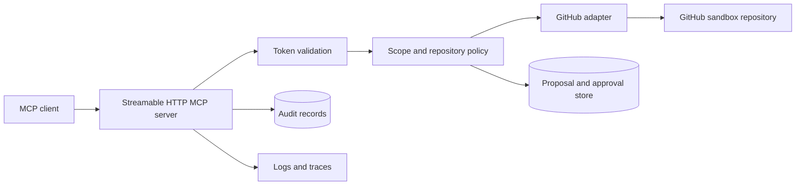

# Project 1 — Engineering Operations MCP

## Project Description

Design and implement a remote MCP server that gives an AI client a narrow, authenticated interface to a real GitHub sandbox repository. The system must support read-only engineering investigation and approval-gated write actions without exposing arbitrary GitHub API access.

The project demonstrates protocol implementation, API integration, authentication, authorization, approval, idempotency, auditability, evaluation, and live troubleshooting.

## Audience

AI application engineers, platform engineers, solution architects, developer educators, and technical trainers.

## Learning Outcomes

By completing the project, a learner should be able to:

- Explain MCP client, server, tool, resource, and backing-service responsibilities.
- Publish and test a Streamable HTTP MCP endpoint.
- Connect MCP tools to an actual external API.
- Implement OAuth-compatible token validation and per-tool scopes.
- Separate authorization from human approval.
- Prevent duplicate or replayed writes.
- Trace and evaluate tool-driven workflows.
- Diagnose protocol, identity, policy, and backing-service failures.

## User Stories

As an authenticated user, I want to:

1. Search issues in an allowlisted repository.
2. Retrieve one issue and selected metadata.
3. List pull requests related to an issue or search term.
4. Inspect recent workflow runs and failed jobs.
5. Draft a new issue or comment without creating it.
6. Approve or reject an exact proposed write.
7. Execute an approved write exactly once.
8. Review an audit record of the proposal, decision, and result.

As an operator, I want to:

1. Restrict repositories and tools through configuration.
2. Disable all write behavior with a kill switch.
3. Trace one request across client, MCP server, policy, and GitHub.
4. Diagnose authentication, authorization, rate-limit, and timeout failures.

## Required MCP Tools

### Read-only

| Tool | Required behavior |
| --- | --- |
| `search_issues` | Search an allowlisted repository with bounded filters and result count |
| `get_issue` | Retrieve one issue without private or unnecessary fields |
| `list_pull_requests` | List relevant pull requests with bounded pagination |
| `get_workflow_status` | Return recent workflow runs and normalized statuses |
| `list_failed_workflow_jobs` | Return failed job and step summaries for one run |

### Proposal and write

| Tool | Required behavior |
| --- | --- |
| `draft_issue` | Validate and persist a proposed issue without calling GitHub |
| `draft_issue_comment` | Validate and persist a proposed comment without calling GitHub |
| `create_issue` | Execute only an unexpired, matching, approved proposal |
| `add_issue_comment` | Execute only an unexpired, matching, approved proposal |
| `rerun_failed_workflow` | Optional advanced write requiring the strongest scope and approval |

Do not expose delete, force-push, repository administration, arbitrary URL, arbitrary GraphQL, or arbitrary REST request tools.

## Minimum Architecture



Required deployed components:

- MCP server
- Relational database for proposals, approvals, and audit records
- OAuth-compatible identity provider or documented equivalent
- GitHub App or appropriately scoped sandbox credential
- Telemetry exporter or inspectable trace sink

## Authentication and Authorization Requirements

1. Publish protected-resource metadata.
2. Validate token signature, issuer, audience, expiration, and scopes.
3. Enforce scope requirements per tool.
4. Restrict repository access through an application allowlist.
5. Reject repository names supplied only through untrusted prompt or tool content.
6. Keep GitHub credentials server-side.
7. Redact tokens and authorization headers from every log and trace.

Minimum scopes:

```text
repo:read
issues:read
issues:write
actions:read
actions:write
```

`actions:write` is required only if the optional rerun tool is implemented.

## Approval Requirements

Every write must:

1. Begin as a persisted proposal.
2. Store canonicalized tool arguments and a payload hash.
3. Pause without calling GitHub.
4. Bind an approval decision to user, proposal, payload hash, expiration, and audit ID.
5. Reject modified, expired, denied, or replayed approvals.
6. Use an idempotency mechanism for execution.
7. Store the resulting GitHub resource or operation ID.

## Data Requirements

Use only:

- A dedicated sandbox repository owned by the learner, or
- A fully local GitHub-compatible test double for recorded mode.

Do not run write tests against production repositories or repositories containing private work.

## Reliability Requirements

- Bounded timeouts for GitHub requests
- Rate-limit recognition and retry-after handling
- Idempotent proposal execution
- Connection pooling and bounded pagination
- Health and readiness endpoints
- Write kill switch
- Recorded mode for deterministic demos
- Safe behavior when the result of a timed-out write is uncertain

## Observability Requirements

Capture:

- Correlation and MCP request IDs
- Authenticated subject, represented by a non-sensitive identifier
- Tool name and sanitized arguments
- Repository policy decision
- Approval status
- Backing-service request ID when available
- Duration and normalized outcome
- Retry and idempotency status

## Required Failure Scenarios

1. MCP server unreachable
2. Tool schema mismatch
3. Missing token
4. Expired token
5. Wrong audience
6. Missing scope
7. Repository outside allowlist
8. GitHub rate limit
9. GitHub resource not found
10. Prompt injection in issue content
11. Modified action after approval
12. Approval replay
13. Timeout with uncertain write outcome
14. Write kill switch enabled

## Suggested Folder Structure

```text
engineering-operations-mcp/
  src/
    mcp_server/
    auth/
    policy/
    github_adapter/
    approvals/
    telemetry/
  migrations/
  tests/
    contract/
    integration/
    security/
  evals/
  fixtures/
  deploy/
  docs/
  compose.yml
  .env.example
  README.md
```

## Deliverables

- Runnable MCP server
- GitHub sandbox integration
- Authentication and scope configuration
- Proposal and approval workflow
- Database migrations
- Contract, integration, and security tests
- MCP Inspector instructions
- Recorded demo
- Architecture and sequence diagrams
- Threat model
- Troubleshooting runbook
- Evaluation report with case-level results

## Acceptance Criteria

- A clean environment can start the stack from documented commands.
- An MCP inspector lists only expected tools.
- Read tools return real data from the configured sandbox.
- A model client can select and call read tools.
- A write request pauses before GitHub is changed.
- Approved writes execute exactly once.
- Denied, expired, modified, and replayed proposals never execute.
- Under-scoped users cannot invoke write tools.
- Issue prompt injection cannot expand the tool surface or bypass approval.
- Every request can be followed through sanitized logs or traces.
- Tests run without requiring access to the maintainer's private credentials.

## Evaluation Rubric

| Area | Points |
| --- | ---: |
| MCP protocol and tool-contract correctness | 20 |
| Real GitHub integration | 15 |
| Authentication and authorization | 15 |
| Approval and idempotency design | 15 |
| Security and prompt-injection resistance | 10 |
| Reliability and failure handling | 10 |
| Tests, evaluations, and observability | 10 |
| Documentation and learner experience | 5 |

## Stretch Goals

- ChatGPT-facing UI component for approval review
- Secure private-network tunnel deployment
- GitHub App installation-token rotation
- Per-organization repository policy
- OpenTelemetry distributed traces
- Signed approval tokens
- Dead-letter handling for uncertain external operations
