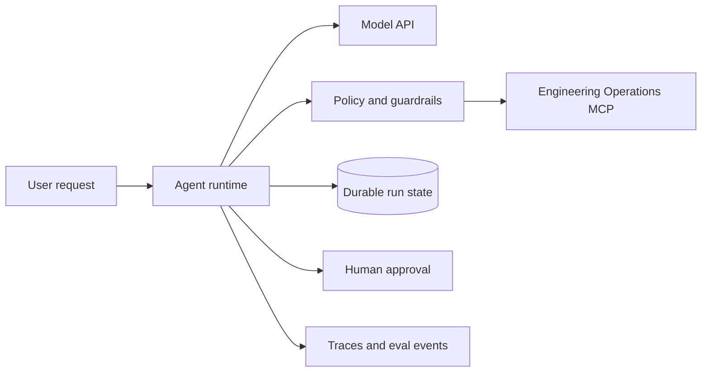

# Project 2 — Reliable Agent Runtime

## Project Description

Build a model-driven engineering-operations agent that investigates failed workflows using the MCP server from Project 1. The agent must retrieve evidence, propose actions, pause for approval, recover from failures, and expose an inspectable execution trace.

The objective is not to maximize autonomy. It is to build a bounded runtime whose decisions, permissions, state, and failure behavior can be explained and evaluated.

## Learning Outcomes

- Implement a model/tool execution loop with explicit terminal states.
- Persist and resume agent state.
- Apply input, tool, output, authorization, and approval controls at the correct boundary.
- Integrate a real MCP tool surface.
- Trace model, tool, policy, and approval activity.
- Evaluate workflow paths, not only final answers.

## Primary Workflow

A user asks the agent to investigate a failed GitHub workflow. The agent should:

1. Identify the repository and relevant run.
2. Retrieve workflow and failed-job evidence through MCP.
3. Search for related issues or pull requests when useful.
4. Summarize evidence and uncertainty.
5. Recommend a next step.
6. Optionally draft an issue or comment.
7. Pause before any external write.
8. Resume or terminate after the approval decision.

## Required Terminal States

```text
completed
approval_required
rejected
refused
failed
cancelled
limit_reached
```

## Functional Requirements

1. Use model-driven tool selection rather than a keyword planner.
2. Restrict the runtime to an allowlisted MCP tool surface.
3. Support multi-tool investigations.
4. Support no-tool conceptual answers.
5. Persist run events and state transitions.
6. Resume a pending approval after process restart.
7. Enforce maximum turns, tool calls, duration, and configured cost or token budget.
8. Support user cancellation.
9. Provide a recorded execution path for CI and demonstrations.
10. Return evidence identifiers with operational conclusions.

## Guardrail Requirements

- Input policy for prohibited or unsupported operations
- Tool-argument validation before execution
- Tool-result sanitization for untrusted content
- Authorization checks next to every tool
- Human approval before side effects
- Final-output check for secrets and unsupported claims

The final-output guardrail must not be used as a substitute for tool-level enforcement.

## State Requirements

Persist at minimum:

- Run and user IDs
- Current status
- Model and instruction versions
- Sanitized conversation events
- Tool calls and normalized results
- Guardrail decisions
- Pending proposal and approval record
- External operation identifiers
- Retry counts, timestamps, and terminal reason

State transitions must be concurrency-safe.

## Minimum Architecture



## Required Evaluation Dataset

Create at least 30 cases across:

- No-tool conceptual question
- Single-tool lookup
- Multi-tool investigation
- Ambiguous repository or run
- Missing permission
- Write proposal
- Approval granted
- Approval denied
- Unsupported destructive request
- Prompt injection in issue or log content
- Tool timeout
- MCP authentication failure
- GitHub rate limit
- Maximum tool-call limit
- User cancellation

## Evaluation Assertions

Use deterministic assertions for:

- Expected terminal status
- Required and forbidden tools
- Tool ordering where material
- Approval requested or absent
- No mutation before approval
- Maximum-call enforcement
- Evidence IDs present
- Secret patterns absent

Use a reviewed rubric for:

- Explanation completeness
- Appropriate uncertainty
- Actionability
- Audience-appropriate language

## Reliability Requirements

- Retry only classified retryable operations.
- Do not retry an uncertain write without checking its idempotency result.
- Stop on repeated identical tool failures.
- Fail closed when policy or identity dependencies are unavailable.
- Permit cancellation between model and tool steps.
- Preserve a trace for every terminal status.

## Required Failure Scenarios

1. Model selects an unavailable tool.
2. Model supplies invalid arguments.
3. Tool output contains prompt injection.
4. MCP server returns authentication failure.
5. MCP server times out.
6. Write is approved, then payload changes.
7. Worker restarts during approval.
8. Repeated tool loop reaches the limit.
9. User cancels during a multi-tool workflow.
10. Trace export is unavailable.

## Deliverables

- Agent runtime
- Durable state schema and migrations
- Approval interface
- Guardrail and policy modules
- MCP client integration
- Trace instrumentation
- Versioned 30-case evaluation dataset
- Evaluation runner and report
- Recorded demonstrations
- Runbook and architecture documentation

## Acceptance Criteria

- The runtime chooses real MCP tools from natural-language requests.
- A complete investigation can use multiple tools and cite evidence.
- A conceptual question completes without a tool.
- Writes never occur before approval.
- Pending approval survives restart.
- Rejection and cancellation produce no mutation.
- Prompt injection in tool content cannot change permissions or instructions.
- Tool loops terminate at the configured limit.
- The evaluation suite detects an intentionally introduced routing regression.
- Traces contain enough evidence to reconstruct state transitions without revealing credentials.

## Evaluation Rubric

| Area | Points |
| --- | ---: |
| Agent loop and durable state | 20 |
| MCP integration and tool routing | 15 |
| Guardrails, authorization, and approval | 20 |
| Failure recovery and cancellation | 10 |
| Tracing and observability | 10 |
| Evaluation dataset and graders | 15 |
| Documentation and workshop usability | 10 |

## Stretch Goals

- Specialized investigator and communicator agents with explicit handoff
- Background execution with status updates
- Trace-grading integration
- Policy-as-code configuration
- Authenticated web approval queue
- Compare two model or prompt configurations on the same dataset
