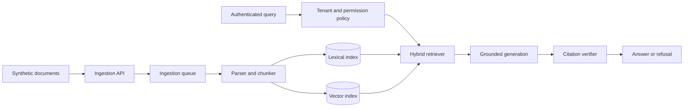

# Project 3 — Tenant-Aware RAG Platform

## Project Description

Build a retrieval-augmented generation platform that ingests versioned technical documents, performs lexical and vector retrieval, enforces tenant permissions before retrieval, generates evidence-bounded answers, and evaluates retrieval separately from answer quality.

The system must demonstrate why a production-shaped RAG architecture is more than a vector database and a prompt.

## Learning Outcomes

- Design asynchronous ingestion and versioned indexing.
- Compare lexical, vector, hybrid, and reranked retrieval.
- Apply authorization before content enters model context.
- Generate and verify stable citations.
- Evaluate retrieval, answer, refusal, latency, and cost behavior.
- Diagnose stale indexes, poor ranking, leakage, and unsupported answers.

## Synthetic Domain

Create at least two synthetic organizations, each with:

- Private runbooks
- Architecture documentation
- Incident retrospectives
- Public shared platform documentation

No real customer, employer, or private repository content may be used.

## Functional Requirements

1. Upload or import supported document types.
2. Store stable document ID, source URI, tenant, version, checksum, timestamps, and permissions.
3. Parse and chunk documents using a documented strategy.
4. Create lexical and vector indexes.
5. Support lexical, vector, and hybrid retrieval modes.
6. Optionally rerank a bounded candidate set.
7. Apply tenant and permission filtering before retrieval results are returned.
8. Generate answers only from retrieved evidence.
9. Return stable citations linked to document versions and chunk IDs.
10. Refuse or request clarification when evidence is insufficient.
11. Remove or replace old document versions without leaving stale searchable chunks.
12. Expose retrieval diagnostics separately from generated answers.

## Minimum Architecture

## Data and Index Requirements

- Stable document and chunk identifiers
- Document checksum and version
- Parser and chunker version
- Embedding model identifier
- Tenant and permission metadata
- Index build identifier and status
- Source heading or section metadata
- Deletion or replacement semantics

## Authorization Requirements

1. Authenticate every query.
2. Determine permitted tenant and document scopes before retrieval.
3. Apply the same constraints to lexical and vector queries.
4. Prevent cached results from bypassing current permissions.
5. Reject citations to unauthorized or deleted content.
6. Add explicit cross-tenant leakage tests.

## Retrieval Evaluation

Create at least 30 queries covering:

- Exact identifiers and error codes
- Semantic paraphrases
- Mixed identifier and natural-language queries
- Multiple relevant sources
- Competing similar sources
- No relevant source
- Stale-version checks
- Tenant leakage attempts

Report:

- Hit rate at 3 and 5
- Precision at 5
- Mean reciprocal rank
- Authorization leakage count
- Retrieval latency by mode

## Answer Evaluation

Evaluate:

- Groundedness
- Citation correctness
- Completeness
- Refusal accuracy
- Unsupported-claim rate
- Answer latency
- Token usage and estimated cost

Preserve case-level results and retrieved IDs.

## Required Experiments

1. Lexical versus vector versus hybrid retrieval.
2. At least two chunking configurations.
3. With and without reranking if reranking is implemented.
4. Old versus updated document version.
5. Authorized versus unauthorized tenant query.
6. Managed retrieval versus self-managed retrieval as an optional advanced comparison.

## Required Failure Scenarios

1. Parser fails on one document.
2. Embedding request is rate limited.
3. Index update partially fails.
4. Old version remains searchable.
5. Authorization filter is missing from one retrieval path.
6. Vector index is unavailable.
7. Generated citation references a non-retrieved chunk.
8. Only part of a multi-part question is supported.
9. Prompt injection appears inside a document.
10. Cache contains a result from an older permission decision.

## Deliverables

- Ingestion API and worker
- Versioned synthetic corpus
- Lexical and vector storage
- Hybrid retriever
- Authorization policy
- Grounded generation and refusal contract
- Citation verifier
- Retrieval and answer evaluation datasets
- Static evaluation reports
- Security tests
- Deployment and reset documentation

## Acceptance Criteria

- Documents ingest asynchronously with visible status.
- Version replacement removes stale searchable content.
- Hybrid retrieval is implemented and compared against its components.
- Unauthorized content never appears in retrieved results or citations.
- Every citation resolves to a retrieved, current document version.
- Unsupported questions refuse or request clarification.
- The evaluation report distinguishes retrieval failures from generation failures.
- A regression that removes one tenant filter is caught automatically.
- The system can run in recorded mode without paid calls.

## Evaluation Rubric

| Area | Points |
| --- | ---: |
| Ingestion, identity, and versioning | 15 |
| Lexical, vector, and hybrid retrieval | 20 |
| Tenant authorization and leakage prevention | 20 |
| Grounded generation and citations | 15 |
| Retrieval and answer evaluation | 15 |
| Reliability and observability | 10 |
| Documentation and learner experience | 5 |

## Stretch Goals

- Query rewriting and decomposition
- Metadata-aware reranking
- Index rollback
- Per-tenant encryption keys
- Online feedback and candidate-eval promotion
- Managed versus self-managed retrieval cost comparison
