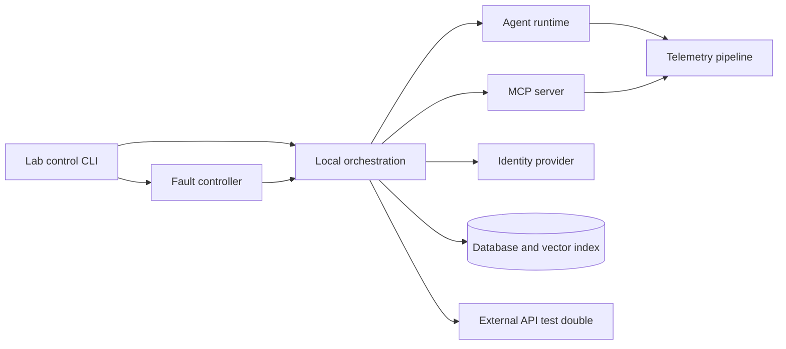

# Project 4 — AI Lab Reliability Platform

## Project Description

Create the operational layer that makes the previous projects teachable in a live workshop. The platform must provision the local services, detect readiness problems, seed sandbox data, inject known failures, collect evidence, and reset safely.

The project treats learner setup and troubleshooting as engineered product experiences.

## Learning Outcomes

- Operate a multi-service AI application locally and in one cloud deployment target.
- Design preflight, liveness, readiness, and end-to-end smoke checks.
- Propagate correlation IDs across service boundaries.
- Use logs, metrics, traces, and audit records appropriately.
- Inject and diagnose realistic failures.
- Build safe, repeatable reset and recorded-mode workflows.

## Supported Training Stack

At minimum, orchestrate:

- Agent API or CLI
- Engineering Operations MCP server
- OAuth-compatible identity provider
- PostgreSQL
- Retrieval service or vector-capable database
- Telemetry collector and inspectable trace sink
- GitHub API test double

Optional live profiles may connect to real model and GitHub services.

## Primary User Stories

As a learner, I want to:

1. Run one command to check prerequisites.
2. Start a known-good recorded environment.
3. Understand which service is not ready and how to repair it.
4. Run a complete smoke test.
5. Receive a fault scenario without seeing the answer.
6. Reset the environment without losing my source code or notes.

As an instructor, I want to:

1. Confirm participant readiness before the lab.
2. Assign specific failure scenarios.
3. View service health without viewing learner secrets.
4. Restore known state between demonstrations.
5. Use recorded mode when external APIs are unavailable.

## Functional Requirements

### Preflight

Check:

- Supported Python and Node versions
- Git and container engine
- Available ports
- Required environment-variable presence
- Disk space
- Container runtime health
- Optional live-service configuration

Return `PASS`, `WARN`, or `FAIL` with an actionable fix.

### Orchestration

- One-command startup
- Dependency-aware readiness
- Database migrations
- Seeded synthetic users, repositories, incidents, and documents
- Isolated named profiles for recorded and live modes
- Explicit shutdown

### Health

Provide:

- Process liveness
- Service readiness
- Dependency diagnostics
- Intentional end-to-end smoke test

Routine probes must not make paid model calls.

### Observability

- Structured JSON logs
- Correlation IDs across services
- Metrics for request count, error count, and latency
- Distributed traces or equivalent request timeline
- Separate approval audit records
- Redaction of configured sensitive fields

### Fault Injection

Provide commands to enable, inspect, and disable faults without editing source code manually.

### Reset

Reset must remove only disposable project state, recreate fixtures, apply migrations, and preserve learner files.

## Minimum Architecture

## Required Fault Catalog

Implement at least ten:

1. MCP host unreachable
2. Wrong MCP protocol path
3. Tool output schema mismatch
4. OAuth metadata unavailable
5. Expired access token
6. Missing scope
7. Database unavailable
8. Database migration missing
9. External API rate limit
10. External write timeout with uncertain result
11. Agent tool loop
12. Stale vector index
13. Trace exporter unavailable
14. Required port already allocated

Every fault needs:

- Identifier and description
- Trigger mechanism
- Expected learner-visible symptom
- Evidence path
- Repair
- Reset verification
- Preventive control discussion

## Cloud Requirement

Deploy at least the non-destructive recorded profile to one cloud target using infrastructure-as-code or a fully documented repeatable deployment.

Explain how local concepts map to:

- Container runtime
- Managed database
- Secret management
- Networking and service discovery
- Health probes
- Logs, metrics, and traces

The deployment does not need multi-region availability, but limitations must be explicit.

## Required Workshop Assets

- Learner setup guide
- Instructor preflight checklist
- 60-minute and 120-minute delivery plans
- Fault-assignment cards or commands
- Troubleshooting worksheet
- Reset runbook
- Recorded demonstration
- Debrief questions

## Deliverables

- Lab control CLI
- Container orchestration
- Preflight, health, smoke, fault, and reset commands
- Seed data and recorded fixtures
- Telemetry configuration
- Fault catalog and runbooks
- Cloud deployment path
- Instructor and learner documentation
- Automated verification suite

## Acceptance Criteria

- A clean supported machine can reach recorded-mode readiness from documented commands.
- Preflight identifies missing prerequisites before startup.
- Every service distinguishes liveness from readiness.
- One request can be traced across agent and MCP services.
- Each required fault produces the documented symptom.
- Learners can repair and verify faults without accessing an answer key.
- Reset restores a known state without deleting learner source code.
- Recorded mode works without external credentials.
- Live mode fails closed when identity, policy, or quota dependencies are unavailable.
- Cloud deployment documentation is reproducible by another learner.

## Evaluation Rubric

| Area | Points |
| --- | ---: |
| Preflight and learner setup experience | 15 |
| Orchestration, health, and readiness | 20 |
| Observability and correlation | 15 |
| Fault injection and diagnostic value | 20 |
| Safe reset and recorded mode | 10 |
| Cloud deployment and security | 10 |
| Instructor and learner assets | 10 |

## Stretch Goals

- Instructor dashboard showing anonymous readiness status
- Per-learner isolated namespaces
- Automated environment report export
- Chaos scheduling for team exercises
- Cloud sandbox budget and automatic cleanup controls
- Browser-based trace explorer linked to study questions
