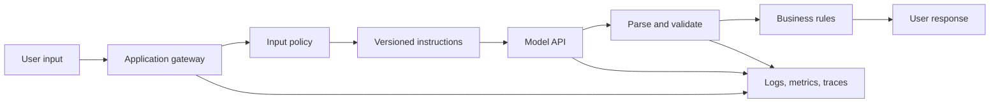

# Model Application Foundations

## Learning Outcomes

By the end of this review, you should be able to:

- Describe the complete request path through a model-backed application.
- Separate probabilistic model behavior from deterministic application behavior.
- Explain structured output, schema validation, streaming, and conversation state.
- Classify authentication, quota, rate-limit, timeout, and contract failures.
- Design a model gateway that is observable, testable, and safe to retry.

## From Model Call to Software System

A model API call is only one component of an AI application. A reliable request normally passes through several boundaries:



The application owns identity, authorization, limits, persistence, validation, and side effects. The model proposes or generates content inside those constraints.

## Instructions Are Not Enforcement

An instruction can ask a model to produce JSON, choose one category, avoid private data, or refuse an unsupported request. That instruction improves behavior, but it does not create a hard software boundary.

Deterministic enforcement belongs in code:

| Desired behavior | Model instruction | Application enforcement |
| --- | --- | --- |
| Return known fields | Describe the output contract | Parse and validate an exact schema |
| Use allowed categories | List accepted values | Reject values outside the enum |
| Avoid oversized input | Ask for concise input | Enforce request-size limits |
| Protect secrets | Tell the model not to reveal secrets | Never place secrets in model context |
| Prevent a write | Ask for confirmation | Require a verified approval before the API call |

This distinction is central to reliable AI engineering: prompts influence behavior; software controls capabilities.

## Structured Output

Structured output makes model results easier for software to consume. A useful contract defines:

- Required and optional fields
- String, numeric, boolean, array, and object types
- Enumerated values
- Null behavior
- Length and range constraints
- Whether unknown fields are rejected

Example:

```json
{
  "summary": "The deployment failed during dependency installation.",
  "category": "build_failure",
  "confidence": 0.86,
  "missing_information": ["dependency lockfile", "build log excerpt"]
}
```

Validation can still fail because the response is malformed, contains an unknown category, omits a field, or is syntactically correct but unsupported by the input. Schema correctness and task correctness are different evaluation dimensions.

## Streaming and State

Streaming improves perceived latency by delivering response events as they arrive. It also introduces additional failure cases:

- The connection may close after a partial response.
- A tool request may appear between text events.
- The client must distinguish completed, failed, and cancelled runs.
- Retrying a partially completed request may duplicate work.

Conversation state can be application-managed or provider-managed. In either design, decide explicitly:

- What history is retained?
- What is sent on each request?
- How is state scoped to the authenticated user?
- How does a user delete or reset it?
- Can an old response safely be resumed?

## Error Taxonomy

Start troubleshooting by locating the failing boundary.

| Symptom | Likely boundary | First evidence |
| --- | --- | --- |
| 401 or authentication error | Credential or identity | Credential presence, audience, expiration |
| 403 | Authorization or policy | Scopes, role, resource ownership |
| 404 | Endpoint, model, or resource | URL, identifier, environment |
| 429 | Rate or quota | Retry headers, account limits, request volume |
| Timeout | Network, model latency, or downstream tool | Per-stage duration and request ID |
| Invalid JSON | Model output or parsing | Raw sanitized output and schema error |
| Correct format, wrong answer | Prompt, evidence, or evaluation | Input, retrieved context, rubric |
| Duplicate action | Retry and idempotency | Idempotency key and external operation ID |

Avoid changing prompts when the actual failure is authentication, networking, deployment configuration, or business validation.

## Retries and Idempotency

A read request is usually safer to retry than a write. For external actions:

1. Assign an idempotency key before the first attempt.
2. Persist the proposed action and request state.
3. Pass the key to the backing service when supported.
4. If a timeout occurs, check whether the operation completed before repeating it.
5. Record the external request or resource identifier.

Never assume that a timeout means nothing happened.

## Observability

A useful request record includes:

- Application request ID and correlation ID
- Prompt or instruction version
- Model identifier
- Start time and per-stage latency
- Token usage and estimated cost where available
- Tool names, sanitized arguments, and outcomes
- Contract-validation result
- Final status: completed, refused, failed, cancelled, or approval-required

Logs should support debugging without storing credentials, raw private content, or unnecessary model context.

## Evaluation Dimensions

Evaluate model applications across separate dimensions:

- Contract validity
- Task correctness
- Grounding
- Safety and privacy
- Refusal behavior
- Latency
- Cost
- User usefulness

A single aggregate score can hide important regressions. Preserve case-level results.

## Review Questions

1. Why is a prompt instruction not an authorization boundary?
2. How can an output pass schema validation but still be wrong?
3. What should an application do after a write request times out?
4. Which fields would you capture to debug a slow response?
5. How do 401, 403, and 429 failures differ?
6. When is streaming valuable, and what new failure states does it create?
7. Why should prompt version and model identifier be recorded together?

## Teaching Prompts

- Ask learners to identify which boxes in the architecture are deterministic.
- Provide one malformed response and one well-formed but unsupported response; ask how each should fail.
- Simulate a timeout after a write and discuss why an immediate retry is unsafe.
- Give learners a mixed log containing application and provider failures and ask them to classify the boundary.
