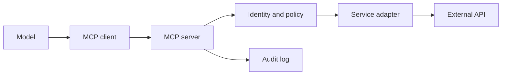

# MCP and Tool Integration

## Learning Outcomes

By the end of this review, you should be able to:

- Explain the responsibilities of an MCP client, MCP server, tool, resource, and backing service.
- Describe tool discovery and invocation over Streamable HTTP.
- Design narrow JSON Schema contracts and meaningful tool metadata.
- Explain authentication, authorization, scopes, approvals, and audit boundaries.
- Diagnose transport, schema, tool, and backing-service failures separately.

## The Integration Problem MCP Solves

Without a shared protocol, every AI client and external system needs a custom integration. MCP standardizes how a client discovers capabilities and invokes them.



MCP does not remove the need for an application architecture. It defines the communication boundary between client and server; the server still owns authentication, authorization, data validation, business rules, retries, and integration behavior.

## Core Responsibilities

| Component | Responsibility |
| --- | --- |
| Model | Selects a capability and proposes arguments based on the conversation |
| MCP client | Connects, discovers capabilities, sends protocol requests, and returns results to the model |
| MCP server | Advertises contracts, validates calls, applies policy, executes tools, and formats results |
| Tool | Performs a bounded operation with a defined input and output contract |
| Resource | Exposes retrievable context or application content identified by a URI |
| Backing service | Performs the actual domain operation, such as searching issues or reading documents |

The model should never receive raw service credentials. The MCP server or its service adapter owns them.

## Tool Discovery

Tool discovery lets a client request the server's available tools. A strong tool definition includes:

- Stable name
- Clear description
- JSON Schema input contract
- Structured output contract
- Read-only, destructive, idempotent, or open-world annotations when applicable
- Authentication requirements
- Concise examples only when they reduce ambiguity

Tool descriptions influence model selection, but the application must still validate every call.

### Narrow Tools Beat Generic Proxies

Prefer:

```text
search_issues(query, repository, state)
get_issue(repository, issue_number)
add_issue_comment(repository, issue_number, body)
```

Avoid:

```text
call_external_api(method, url, headers, body)
```

The generic proxy is difficult to authorize, evaluate, explain, and constrain. Narrow tools expose business intent and make the permission model reviewable.

## Transport

A remote server commonly uses Streamable HTTP. Protocol debugging should distinguish:

1. Can the client reach the server?
2. Can it initialize a session?
3. Can it list tools?
4. Can it call a read-only tool?
5. Can it parse the structured result?
6. Can the server reach its backing service?

An HTTP 200 from the MCP endpoint does not prove that a backing API call works.

## Authentication and Authorization

Authentication establishes who is calling. Authorization decides what that identity may do.

A production-oriented flow may include:

- Protected-resource metadata published by the MCP server
- Authorization-server metadata
- Authorization code flow with PKCE
- Access tokens with an audience bound to the MCP resource
- Per-tool security schemes
- Scopes such as `issues:read` and `issues:write`
- Server-side verification of issuer, audience, expiration, and scope

Never authorize using locale, user-agent hints, prompt content, or a model's assertion that the user has permission.

## Approval Is Different From Authorization

A user can be authorized to perform an action while the action still requires explicit approval.

Example:

- The token has `issues:write`.
- The tool call requests adding a comment.
- Policy classifies this as a side effect.
- The run pauses with the exact proposed action.
- Approval binds to the action payload, user, expiration, and audit ID.
- If the payload changes, the approval is invalid.

Authorization answers **may this identity perform this class of action?** Approval answers **does the user consent to this exact action now?**

## Prompt Injection and Tool Output

External data can contain instructions designed to manipulate the model. Treat issue bodies, documents, web pages, tool output, and resource content as untrusted data.

Mitigations include:

- Keep tool permissions narrow.
- Filter available tools for the task.
- Require approval for side effects.
- Separate data from server instructions.
- Validate tool arguments in code.
- Do not follow arbitrary URLs returned by tools.
- Redact credentials and private fields before returning content.
- Log what data crosses the server boundary.

Prompt injection cannot be solved by a single prompt. It is a system-design problem.

## Tool Failure Model

An MCP tool can fail at multiple layers:

| Layer | Example |
| --- | --- |
| Transport | Server unreachable or connection interrupted |
| Protocol | Invalid request or unsupported capability |
| Schema | Missing or incorrectly typed argument |
| Authentication | Expired or invalid token |
| Authorization | Missing required scope |
| Policy | Approval required or action prohibited |
| Backing service | Rate limit, outage, or missing resource |
| Result contract | Service returned data that cannot be normalized |

Return errors that are useful to the client without exposing tokens, stack traces, or internal service topology.

## Testing Strategy

Test the server independently of a model first:

1. List tools using an MCP inspector or SDK client.
2. Call each read-only tool with valid inputs.
3. Run schema-invalid inputs.
4. Run missing, expired, and under-scoped tokens.
5. Confirm writes pause without approval.
6. Confirm replayed approvals fail.
7. Simulate backing-service timeouts and rate limits.
8. Only then evaluate whether the model chooses tools correctly.

Protocol correctness and model behavior are separate test suites.

## Review Questions

1. What does MCP standardize, and what responsibilities remain application-specific?
2. Why is an arbitrary HTTP proxy a dangerous tool design?
3. What is the difference between authorization and approval?
4. Where should external API credentials live?
5. Why should issue bodies and retrieved documents be treated as untrusted?
6. How would you distinguish an MCP transport error from a GitHub API error?
7. What should happen when an approved action's arguments change?

## Teaching Prompts

- Draw the client/server/backing-service flow and ask learners to place each security check.
- Give learners five tool definitions and ask which are too broad.
- Show the same request with `issues:read` and `issues:write` tokens.
- Insert a prompt-injection string into an issue body and inspect the trace without enabling writes.
