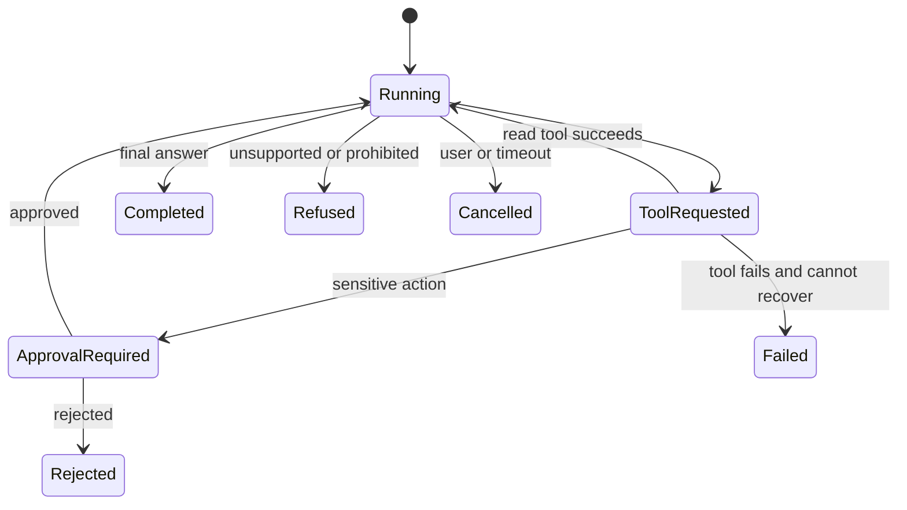

# Agent Runtime, Safety, and Evaluation

## Learning Outcomes

By the end of this review, you should be able to:

- Describe an agent as a stateful workflow rather than a single prompt.
- Explain the agent loop, tool selection, state transitions, and terminal outcomes.
- Place guardrails and approval boundaries at the correct layer.
- Use traces to debug model, routing, tool, and policy behavior.
- Build behavioral datasets that evaluate complete workflows.

## What Makes a Workflow Agentic?

A model-backed application becomes agentic when the model can select actions and the runtime continues based on their results.

The runtime—not the model—owns these state transitions.

## The Agent Loop

A typical loop is:

1. Receive input and current state.
2. Apply input policy.
3. Ask the model for the next response or tool call.
4. Validate the selected tool and arguments.
5. Execute, pause, or reject the action.
6. Append the sanitized result to state.
7. Continue until a terminal status or limit is reached.

Essential limits include maximum model turns, maximum tool calls, wall-clock timeout, token or cost budget, and cancellation support.

## Durable State

In-memory state disappears when a process restarts. A workflow that can pause for approval needs durable state containing:

- Run ID and authenticated owner
- Current status
- Versioned instructions and model identifier
- Sanitized conversation or event history
- Proposed tool call and validated arguments
- Approval record
- Tool results and external request IDs
- Attempt counts and timestamps

Persist state transitions atomically. A run should not be both `approval_required` and `completed` due to concurrent workers.

## Guardrail Placement

Different controls solve different problems:

| Control | Purpose |
| --- | --- |
| Input guardrail | Reject or transform disallowed input before the main workflow |
| Tool argument guardrail | Validate or redact a proposed tool call |
| Tool result guardrail | Validate untrusted data returned by a tool |
| Output guardrail | Validate or redact the final response |
| Authorization policy | Enforce identity and resource permissions |
| Approval | Pause before a specific sensitive side effect |

Do not rely on a final-output guardrail to protect a tool that already changed an external system.

## Human Approval

A safe approval record should bind:

- Run ID
- User or policy identity
- Tool name
- Canonicalized arguments or payload hash
- Decision
- Expiration
- Timestamp
- Audit identifier

Approvals must be single-use where replay would be unsafe. Reject an approval if the proposed action changes.

## Failure and Recovery

Classify tool failures as retryable, non-retryable, or uncertain:

- Retryable: temporary service unavailable before any side effect.
- Non-retryable: invalid arguments or missing permission.
- Uncertain: timeout after sending a write request.

For uncertain results, query the external system using the idempotency key or operation identifier before retrying.

The model may propose a recovery plan, but code decides whether another attempt is allowed.

## Traces

A trace records the end-to-end workflow:

- Model calls
- Tool selections
- Validated arguments
- Guardrail decisions
- Approval pauses and decisions
- Tool outcomes
- Handoffs
- Final result

Use traces for two separate jobs:

1. Debug a specific run.
2. Build repeatable evaluations from observed failure patterns.

Redact secrets and minimize stored private content before exporting traces.

## Agent Evaluation

Agent evaluation should test the path, not only the final sentence.

Useful assertions include:

- Expected tool selected
- Forbidden tool not selected
- Tool order correct
- Approval requested when required
- No side effect before approval
- Correct refusal or escalation
- Maximum-call limit respected
- External evidence cited
- Sensitive content absent from final output

Include cases for happy paths, ambiguity, no-tool answers, tool errors, prompt injection, insufficient permissions, approval rejection, and timeouts.

## Deterministic and Model-Based Grading

Use deterministic checks for objective behavior:

- Exact terminal status
- Tool presence or absence
- Schema validity
- Permission decision
- Citation identifiers
- Latency or call-count limits

Use model-based or human grading for subjective dimensions:

- Completeness
- Explanation quality
- Appropriate uncertainty
- Audience fit

Calibrate subjective graders against reviewed examples.

## Review Questions

1. Why does a paused approval require durable state?
2. Which control should validate a tool's arguments?
3. What makes a timeout after a write different from a timeout before a write?
4. Why is final-answer evaluation insufficient for an agent?
5. Which trace fields would prove that no write occurred before approval?
6. What should happen when the tool-call limit is reached?
7. When should a workflow escalate instead of retrying?

## Teaching Prompts

- Give learners an event trace and ask them to reconstruct the state machine.
- Remove the tool-level guardrail and ask which attacks become possible.
- Simulate a process restart while approval is pending.
- Compare two agents with identical final answers but different tool paths.
