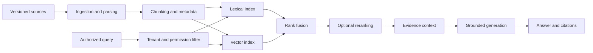

# RAG Systems and Evaluation

## Learning Outcomes

By the end of this review, you should be able to:

- Separate ingestion, indexing, retrieval, reranking, generation, and evaluation.
- Compare lexical, vector, and hybrid retrieval.
- Explain why authorization filtering must occur before generation.
- Design stable citations, document versions, and refusal behavior.
- Evaluate retrieval and answer quality with separate metrics.

## RAG Is a Pipeline

Retrieval-augmented generation grounds a model response in selected external evidence.

When an answer fails, identify which stage introduced the error.

## Ingestion and Document Identity

An ingestion system should preserve:

- Stable document ID
- Source URI
- Tenant or owner
- Version and checksum
- Creation and update timestamps
- Permission metadata
- Parser and chunker version
- Index status

Without stable identity, citations break and stale chunks remain difficult to remove.

## Chunking

Chunk size changes retrieval behavior. Chunks that are too small lose context; chunks that are too large dilute relevance and increase prompt cost.

Useful strategies include:

- Heading-aware markdown chunks
- Paragraph or sentence windows
- Fixed token windows with overlap
- Table-aware parsing
- Code-symbol or file-aware chunks
- Document-type-specific strategies

Evaluate chunking choices against representative queries rather than relying on one universal size.

## Retrieval Types

### Lexical retrieval

Matches terms and phrases. It works well for identifiers, error codes, names, and exact wording but may miss semantic paraphrases.

### Vector retrieval

Uses embeddings to find semantically similar content. It handles paraphrases but may return conceptually related content that lacks the necessary exact detail.

### Hybrid retrieval

Combines both result sets, often through rank fusion. Hybrid retrieval is useful when queries mix natural-language intent with product names, IDs, or error codes.

### Reranking

A reranker scores a smaller candidate set more precisely. It can improve relevance but adds latency, cost, and another component to evaluate.

## Authorization Before Retrieval

Never retrieve broadly and ask the model to ignore unauthorized documents. Permission filtering must constrain candidate documents before content enters model context.

Tests should prove:

- Tenant A cannot retrieve Tenant B content.
- Public content remains available to both.
- Permission changes take effect predictably.
- Cached results do not bypass the current authorization decision.
- Citations never reference unauthorized sources.

## Grounded Generation and Refusal

The generation contract should tell the model to answer only from supplied evidence and identify sources. The application should also verify:

- Every citation refers to a retrieved chunk.
- The cited chunk exists in the indexed version.
- The answer does not claim unsupported external actions.
- Insufficient evidence triggers a clear refusal or clarification request.

RAG reduces some hallucinations; it does not guarantee truth.

## Evaluation Layers

### Retrieval evaluation

| Metric | Question |
| --- | --- |
| Hit rate at k | Did an expected source appear in the top results? |
| Precision at k | How many retrieved chunks were relevant? |
| Recall at k | How much expected evidence was retrieved? |
| Mean reciprocal rank | How early did the first relevant result appear? |
| Authorization leakage | Did any forbidden source appear? |

### Answer evaluation

- Groundedness
- Citation correctness
- Completeness
- Refusal accuracy
- Unsupported-claim rate
- Usefulness

### Operational evaluation

- Ingestion latency
- Query latency by stage
- Index freshness
- Token usage
- Cost per answer
- Error and refusal rates

Do not use answer quality to hide poor retrieval. Preserve retrieved IDs and scores for diagnosis.

## Common Failure Modes

| Failure | Likely cause |
| --- | --- |
| Correct document missing | Chunking, index freshness, query expansion, or permission filter |
| Related but wrong document dominates | Vector similarity without lexical constraints |
| Citation points to stale text | Incomplete version replacement or cache invalidation |
| Cross-tenant result | Missing or late authorization filter |
| Fluent unsupported answer | Weak evidence contract or no refusal evaluation |
| High latency | Excess candidates, reranker, large context, or sequential service calls |

## Review Questions

1. Why should retrieval and answer evaluation remain separate?
2. When does lexical retrieval outperform vector retrieval?
3. Where should tenant filtering occur?
4. What metadata is needed for stable citations?
5. Why can a semantically relevant chunk still be a poor answer source?
6. How would you test index freshness?
7. What should happen when only half of a multi-part question is supported?

## Teaching Prompts

- Run the same query through lexical, vector, and hybrid retrieval and compare rankings.
- Remove the tenant filter in a controlled test and inspect what leaks.
- Change the chunk size and predict which questions improve or regress.
- Give learners a fluent answer with incorrect citations and ask which evaluation layer failed.
