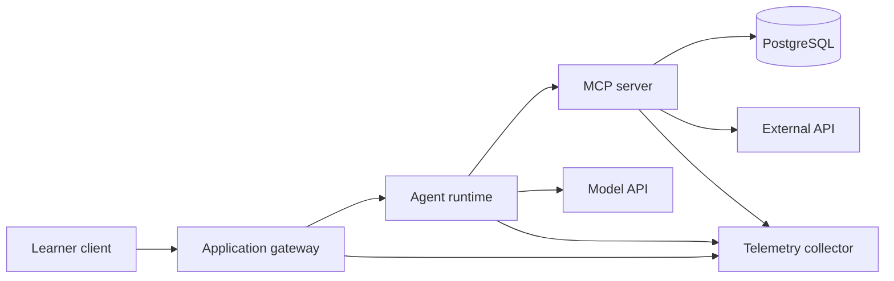

# Cloud Operations and Live Troubleshooting

## Learning Outcomes

By the end of this review, you should be able to:

- Describe the runtime dependencies of a multi-service AI application.
- Distinguish startup, readiness, liveness, and dependency health.
- Trace one request across gateway, agent, MCP, database, and external API boundaries.
- Use logs, metrics, traces, and audit records for different diagnostic questions.
- Design workshop preflight, fault-injection, and reset workflows.

## The Runtime Is Part of the Lab

An advanced AI lab may include:

- Browser or CLI client
- Application API
- Model API
- Agent runtime
- MCP server
- OAuth provider
- PostgreSQL
- Vector index
- External service API
- Telemetry collector

If any dependency is unavailable or misconfigured, the learner may see a generic failure far from the cause.

## Health Semantics

| Check | Meaning |
| --- | --- |
| Process started | The process exists, but may not be usable |
| Liveness | The process is responsive enough to remain running |
| Readiness | The service can currently accept intended traffic |
| Dependency health | A required downstream system is reachable and correctly configured |
| End-to-end smoke test | A representative request completes across the entire path |

Do not make a health endpoint perform costly model calls on every probe. Separate configuration health, dependency checks, and intentional smoke tests.

## Configuration and Secrets

Configuration should identify environment-specific values such as endpoints, ports, model IDs, database URLs, and feature flags. Secrets require a separate protected channel.

Good practices:

- Commit `.env.example`, never a populated `.env`.
- Validate required settings at startup.
- Report that a secret is missing without printing its value.
- Use short-lived credentials where possible.
- Scope external credentials to a sandbox.
- Support a kill switch for live or billable behavior.

## Observability Signals

### Logs

Logs describe discrete events. Use structured fields such as service, request ID, stage, status, and error category.

### Metrics

Metrics answer aggregate questions: request rate, error rate, latency percentiles, token use, tool-call counts, and queue depth.

### Traces

Traces follow one request across services and show which stage consumed time or failed.

### Audit records

Audit records answer governance questions: who proposed an action, who approved it, what exact payload was executed, and what external result occurred.

One signal does not replace the others.

## A Troubleshooting Method

Use a consistent sequence:

1. Restate the expected behavior.
2. Capture the exact symptom and request ID.
3. Identify the last confirmed-good boundary.
4. Check health and configuration before changing code.
5. Inspect the trace and relevant structured logs.
6. Form one testable hypothesis.
7. Make the smallest diagnostic change.
8. Retest from a known state.
9. Record the cause and preventive control.

Avoid changing dependencies, prompts, network settings, and code simultaneously.

## Workshop Preflight

A preflight command should check:

- Supported runtime versions
- Required CLI tools
- Available ports
- Container engine health
- Disk space
- Required environment-variable presence
- Database migration state
- MCP tool discovery
- OAuth metadata reachability
- Recorded-mode availability

Return `PASS`, `WARN`, or `FAIL` with an actionable next step.

## Fault Injection

Controlled failures make troubleshooting teachable. Useful scenarios include:

- Wrong MCP endpoint
- Invalid OAuth audience
- Missing scope
- Expired token
- Database unavailable
- Schema migration missing
- Backing API rate limit
- Tool result violates schema
- Agent reaches maximum tool calls
- Vector index contains stale version
- Trace exporter unavailable

Each scenario needs a trigger, expected symptom, evidence path, repair, and reset command.

## Reset and Recovery

A workshop reset should:

- Stop services cleanly.
- Remove only disposable lab state.
- Preserve learner source code and debugging notes.
- Recreate known test data.
- Reapply migrations.
- Restore recorded fixtures.
- Re-run readiness checks.

Never make the reset command broad enough to delete unrelated Docker volumes, repositories, or user files.

## Cloud Translation

Local containers teach service boundaries that map to cloud concepts:

| Local concept | Cloud equivalent |
| --- | --- |
| Container service | Managed container runtime or Kubernetes workload |
| `.env` value | Deployment configuration or secret manager reference |
| Docker network | Virtual network and service discovery |
| Local PostgreSQL | Managed relational database |
| Local volume | Managed persistent storage |
| Compose health check | Platform readiness or health probe |
| Local collector | Managed telemetry pipeline |

Learners should explain the mapping without claiming that local Compose provides production availability or security.

## Review Questions

1. What is the difference between liveness and readiness?
2. Why should a normal health probe avoid billable model calls?
3. Which signal would you use to investigate one slow request?
4. Which record proves who approved an external write?
5. What should a preflight command verify before a workshop?
6. Why must a reset preserve learner code and debugging notes?
7. How do local container concepts translate into cloud architecture?

## Teaching Prompts

- Give each learner group a different seeded failure with the same visible browser error.
- Ask learners to locate the last confirmed-good service using a trace.
- Compare a liveness-only health check with a true readiness check.
- Have learners write a reset plan and identify destructive assumptions before running it.
