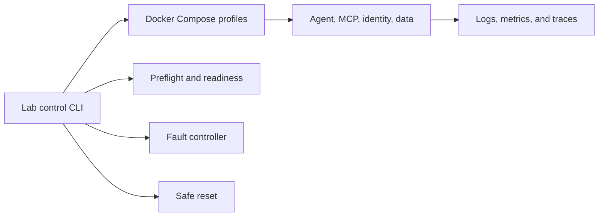

# Reference Solution — AI Lab Reliability Platform

Status: **implementation scaffold**

This directory will contain the reference implementation for [Project 4 — AI Lab Reliability Platform](../../projects/project-04-ai-lab-reliability-platform.md).

## Target Architecture



## Planned Implementation

- Cross-platform lab control CLI
- Recorded and live Compose profiles
- Preflight, liveness, readiness, and smoke checks
- Synthetic seed data
- Declarative fault catalog
- Safe targeted reset
- OpenTelemetry collection and trace viewing
- Instructor and learner delivery assets
- One reproducible cloud deployment path

## Intended Structure

```text
ai-lab-reliability-platform/
  cli/
  compose/
  faults/
  fixtures/
  telemetry/
  cloud/
  workshop/
  tests/
```

## Safety Boundary

Reset and cleanup commands must resolve explicit project-owned targets. They must never delete broad Docker, filesystem, cloud-account, or repository state.

## Design Decisions to Document

- Readiness semantics
- Recorded/live profile boundaries
- Fault activation and repair
- Reset target validation
- Secret handling
- Local-to-cloud concept mapping
