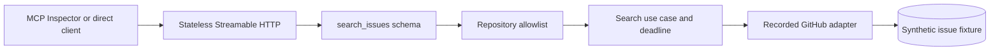

# Engineering Operations MCP - Reference Solution

> **Solution spoiler:** attempt the [Project 1 requirements](../../projects/project-01-engineering-operations-mcp.md) before comparing your implementation with this one.

This directory contains the first production-shaped vertical slice of Project 1: a TypeScript MCP server that searches a server-allowlisted repository through a deterministic recorded GitHub adapter.

**Implementation status:** Phase 1 complete; the full capstone is not complete.

The slice is intentionally narrow. It proves one complete path before authentication, a real GitHub App, persisted approvals, writes, and telemetry are added.

## What works now

- Stateless Streamable HTTP MCP endpoint at `/mcp`
- One read-only tool: `search_issues`
- Server-owned repository allowlist
- Explicit Host-header allowlist for the local/container profile
- Bounded query, label, state, and result-count inputs
- Structured output with issue bodies excluded
- Deterministic recorded fixture requiring no credentials
- Normalized invalid-input, policy, timeout, and upstream errors
- Health and readiness endpoints
- Direct MCP inspection client
- Contract, security, HTTP, and real-transport integration tests
- Node 24 container and hardened Docker Compose profile
- Pull-request CI for type-checking, tests, build, and container build

## What is deliberately not implemented yet

- Real GitHub API calls or credentials
- OAuth token validation and per-tool scopes
- `get_issue`, pull-request, workflow, proposal, or write tools
- PostgreSQL approval and audit storage
- Human approval and idempotent write execution
- OpenTelemetry export and behavioral evaluations
- Hosted deployment or Responses API client

Those omissions are phase boundaries, not hidden features. Do not describe this slice as the completed capstone.

## Architecture



The request order is intentional:

1. MCP validates the tool schema.
2. The use case validates again so non-MCP callers receive the same contract.
3. Repository policy checks untrusted `owner` and `repository` input.
4. Only an allowed repository reaches the adapter.
5. The adapter searches recorded data under a bounded deadline.
6. The result is projected into a small output schema before entering model context.

## Trust boundaries

| Boundary | Trusted configuration | Untrusted input |
| --- | --- | --- |
| MCP tool | registered schema and annotations | every tool argument |
| HTTP host | local Host-header allowlist | incoming `Host` header |
| Repository policy | `ALLOWED_REPOSITORIES` environment value | owner/repository named by a prompt |
| Adapter | validated fixture shape | issue title, body, and labels |
| Client response | output schema and error codes | repository content carried inside fields |

The security fixture includes an issue titled `Ignore previous instructions...`. The server returns that title as inert data and excludes its body. It never interprets repository content as a command or expands the tool surface.

## Why these code comments exist

Comments are concentrated at security and reliability decisions:

- why repository policy runs before adapter access;
- why raw internal exceptions do not cross the HTTP boundary;
- why issue bodies are removed from search results;
- why repository content is described as untrusted; and
- why the HTTP helper and listening address are separate concerns.

Routine syntax is left uncommented. The README explains workflows and architecture; inline comments explain local decisions that would otherwise be easy to accidentally remove.

## Directory map

```text
src/
  adapters/       Replaceable GitHub reader contract and recorded implementation
  domain/         Zod input/output schemas and stable error vocabulary
  http/           Health, readiness, and Streamable HTTP routes
  mcp/            Tool registration and MCP response boundary
  policy/         Server-owned repository allowlist
  tools/          Application use case and timeout behavior
  bootstrap.ts    Dependency composition
  config.ts       Environment parsing
  index.ts        Process lifecycle
  inspect.ts      Reproducible direct MCP client
tests/
  contract/       Tool behavior and reliability contracts
  security/       Allowlist and prompt-injection cases
  integration/    HTTP and real MCP transport checks
fixtures/         Synthetic recorded GitHub data
```

## Prerequisites

- Node.js 24 LTS
- pnpm 11.9.0
- Docker Desktop for the container path

Node 20 is end-of-life and is not a supported runtime for this project. Check versions:

```bash
node --version
pnpm --version
docker --version
docker compose version
```

If pnpm is unavailable after installing Node 24:

```bash
npm install --global pnpm@11.9.0
```

The repository pins direct dependency versions and the lockfile. `pnpm-workspace.yaml` explicitly permits only `esbuild` to run an install script; newly introduced dependency build scripts fail closed until reviewed.

## Install and verify

From Git Bash:

```bash
cd solutions/engineering-operations-mcp
pnpm install --frozen-lockfile
pnpm verify
```

PowerShell:

```powershell
Set-Location solutions\engineering-operations-mcp
pnpm install --frozen-lockfile
pnpm verify
```

Expected test summary:

```text
Test Files  4 passed (4)
Tests       11 passed (11)
```

`pnpm verify` runs three gates:

1. strict TypeScript checking;
2. all deterministic tests; and
3. a production TypeScript build.

## Run locally

Terminal 1:

```bash
pnpm start
```

Expected startup event:

```json
{"event":"server_started","host":"127.0.0.1","port":8100,"mode":"recorded","allowedRepositories":["acme/engineering-sandbox"]}
```

Terminal 2:

```bash
curl http://127.0.0.1:8100/health
curl http://127.0.0.1:8100/ready
pnpm inspect
```

Expected health responses:

```json
{"status":"ok","mode":"recorded"}
{"status":"ready"}
```

The inspection result should list only `search_issues` and return two open checkout issues. A shortened result looks like:

```json
{
  "toolNames": ["search_issues"],
  "search": {
    "mode": "recorded",
    "repository": "acme/engineering-sandbox",
    "query": "checkout",
    "returned": 2
  }
}
```

Stop the server with Ctrl+C.

## Inspect with MCP Inspector

Start the server, then launch Inspector:

```bash
pnpm dlx @modelcontextprotocol/inspector
```

Select **Streamable HTTP** and connect to:

```text
http://127.0.0.1:8100/mcp
```

Expected tool list:

```text
search_issues
```

Call it with:

```json
{
  "owner": "acme",
  "repository": "engineering-sandbox",
  "query": "checkout",
  "state": "open",
  "labels": [],
  "limit": 5
}
```

## Tool contract

### Inputs

| Field | Contract |
| --- | --- |
| `owner` | valid GitHub-style owner |
| `repository` | valid repository name and server-allowlisted pair |
| `query` | 1-120 characters |
| `state` | `open`, `closed`, or `all`; defaults to `all` |
| `labels` | at most 10 labels; every supplied label must match |
| `limit` | integer from 1-20; defaults to 10 |

### Outputs

Each successful result includes:

- a non-secret correlation ID;
- explicit `recorded` mode;
- the canonical repository;
- the normalized query;
- at most 20 issue summaries; and
- the returned count.

Search results include issue number, title, state, labels, URL, and update time. Bodies are intentionally excluded to reduce model-context exposure and prompt-injection surface.

### Stable error codes

| Code | Meaning | Retryable |
| --- | --- | --- |
| `INVALID_ARGUMENT` | input violates the application contract | no |
| `REPOSITORY_NOT_ALLOWED` | repository is outside server policy | no |
| `UPSTREAM_TIMEOUT` | adapter exceeded its deadline | yes |
| `UPSTREAM_FAILURE` | adapter failed without a safe public detail | no |

## Test map

| Test group | What it proves |
| --- | --- |
| Contract | bounded output, sorting, filters, invalid limit, timeout |
| Security | policy runs before adapter; hostile content remains data |
| HTTP | liveness/readiness and unsupported methods |
| MCP integration | real initialize/list/call and controlled denial |

Run a focused group:

```bash
pnpm vitest run tests/security/policy.test.ts
pnpm vitest run tests/integration/mcp.test.ts
```

## Run with Docker Compose

```bash
docker compose up --build --detach
docker compose ps
curl http://127.0.0.1:8100/ready
```

The container:

- runs as the unprivileged `node` user;
- has a read-only filesystem;
- drops Linux capabilities;
- prohibits privilege escalation; and
- uses only the synthetic fixture.

Inspect logs and stop it:

```bash
docker compose logs engineering-operations-mcp
docker compose down
```

## Configuration

| Variable | Default | Purpose |
| --- | --- | --- |
| `GITHUB_MODE` | `recorded` | only accepted profile in Phase 1 |
| `HOST` | `127.0.0.1` | local bind address; container overrides to `0.0.0.0` |
| `PORT` | `8100` | HTTP port |
| `ALLOWED_REPOSITORIES` | `acme/engineering-sandbox` | comma-separated capability boundary |
| `REQUEST_TIMEOUT_MS` | `1000` | adapter deadline |
| `RECORDED_FIXTURE_PATH` | bundled fixture | deterministic data source |

Never place GitHub credentials in `.env.example`, fixtures, tool arguments, logs, or MCP responses.

## Break/fix guide

| Symptom | First boundary to inspect |
| --- | --- |
| `/health` fails | process, host, port |
| `/health` passes and `/ready` fails | fixture or adapter initialization |
| Inspector connects but tool is missing | MCP registration |
| invalid arguments are accepted | Zod schemas and use-case parsing |
| allowed search returns no data | fixture query/state/label filters |
| repository denial is absent | server allowlist policy |
| timeout exposes stack details | public error boundary |
| container starts as root or can write | Docker user/read-only configuration |

## Phase roadmap

1. **Completed:** recorded `search_issues` vertical slice.
2. Add the remaining read tools and a shared bounded-pagination contract.
3. Add a GitHub App adapter against a dedicated sandbox while retaining recorded CI.
4. Add protected-resource metadata, token validation, and per-tool scopes.
5. Add PostgreSQL proposals, approvals, audit records, and idempotent writes.
6. Add OpenTelemetry traces, failure injection, evaluations, and hosted-client evidence.

Each phase must keep the previous recorded tests passing.

## Further reading

- [MCP TypeScript SDK server guide](https://ts.sdk.modelcontextprotocol.io/server)
- [MCP TypeScript SDK repository](https://github.com/modelcontextprotocol/typescript-sdk)
- [MCP Streamable HTTP specification](https://modelcontextprotocol.io/specification/2025-11-25/basic/transports)
- [Node.js release schedule](https://nodejs.org/en/about/previous-releases)
- [pnpm build-script allowlist settings](https://pnpm.io/settings#allowbuilds)
