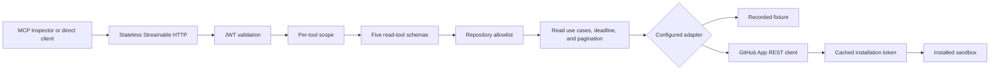

# Engineering Operations MCP - Reference Solution

> **Solution spoiler:** attempt the [Project 1 requirements](../../projects/project-01-engineering-operations-mcp.md) before comparing your implementation with this one.

This directory contains the production-shaped read surface of Project 1: a TypeScript MCP server that investigates issues, pull requests, and workflow failures through interchangeable recorded and real GitHub App adapters.

**Implementation status:** Phases 1-4 complete and verified; the full capstone is not complete.

The implementation proves the complete authenticated, read-only investigation path in deterministic recorded mode and against a real, least-privilege GitHub App installation. Use the [Phase 2 recorded walkthrough](docs/phase-02-read-tools.md), the [Phase 3 GitHub App walkthrough](docs/phase-03-github-app.md), and then the [Phase 4 authorization walkthrough](docs/phase-04-auth-scopes.md).

## What works now

- Stateless Streamable HTTP MCP endpoint at `/mcp`
- Five read-only tools: `search_issues`, `get_issue`, `list_pull_requests`, `get_workflow_status`, and `list_failed_workflow_jobs`
- Server-owned repository allowlist
- Explicit Host-header allowlist for the local/container profile
- Bounded query, filter, result-count, and shared pagination inputs
- Provider workflow states normalized to a small stable vocabulary
- Structured output with search bodies excluded and detail excerpts explicitly labeled as untrusted
- Deterministic recorded fixture requiring no credentials
- Real GitHub App adapter using versioned REST endpoints
- RS256 app JWTs and cached, repository-narrowed installation tokens
- OAuth protected-resource metadata and discoverable bearer challenges
- RS256 access-token validation for signature, issuer, audience, expiration, and subject
- Per-tool `repo:read`, `issues:read`, and `actions:read` authorization scopes
- Remote JWKS and pinned local public-key verification profiles
- Normalized authentication, permission, not-found, timeout, and rate-limit failures
- Normalized invalid-input, policy, timeout, and upstream errors
- Health and readiness endpoints
- Direct MCP inspection client
- Contract, security, HTTP, and real-transport integration tests
- Node 24 container and hardened Docker Compose profile
- Pull-request CI for type-checking, tests, build, and container build

## What is deliberately not implemented yet

- Proposal and write tools
- PostgreSQL approval and audit storage
- Human approval and idempotent write execution
- OpenTelemetry export and behavioral evaluations
- Hosted deployment or Responses API client

Those omissions are phase boundaries, not hidden features. Do not describe this slice as the completed capstone.

## Architecture



The request order is intentional:

1. The HTTP boundary validates the bearer token for this resource.
2. The authorization boundary checks the specific tool scope.
3. MCP validates the tool schema.
4. The use case validates again so non-MCP callers receive the same contract.
5. Repository policy checks untrusted `owner` and `repository` input.
6. Only an allowed repository reaches the adapter.
7. The adapter reads data under a bounded deadline and bounded page request.
8. The result is projected into a small output schema before entering model context.

## Trust boundaries

| Boundary | Trusted configuration | Untrusted input |
| --- | --- | --- |
| MCP tool | registered schema and annotations | every tool argument |
| HTTP host | local Host-header allowlist | incoming `Host` header |
| MCP identity | trusted issuer, audience, and verification key | bearer token and its claims |
| Tool scope | server-owned tool-to-scope map | scopes granted by the token |
| Repository policy | `ALLOWED_REPOSITORIES` environment value | owner/repository named by a prompt |
| Adapter | validated fixture/API shapes and server credentials | issue, pull-request, workflow, and job content |
| Client response | output schema and error codes | repository content carried inside fields |

The security fixture includes an issue titled `Ignore previous instructions...`. Search returns only its inert title. Detail lookup returns a bounded body excerpt with `contentTrust: "untrusted_repository_content"`. The server never interprets repository content as a command or expands its tool surface.

## Why these code comments exist

Comments are concentrated at security and reliability decisions:

- why repository policy runs before adapter access;
- why raw internal exceptions do not cross the HTTP boundary;
- why issue bodies are removed from search results;
- why repository content is described as untrusted; and
- why the HTTP helper and listening address are separate concerns.

Routine syntax is left uncommented. The README explains workflows and architecture; inline comments explain local decisions that would otherwise be easy to accidentally remove.

## Directory map

```text
src/
  adapters/       Replaceable GitHub reader contract and recorded implementation
  auth/           GitHub App auth, MCP JWT validation, metadata, and scopes
  domain/         Zod input/output schemas and stable error vocabulary
  http/           Health, readiness, and Streamable HTTP routes
  mcp/            Tool registration and MCP response boundary
  policy/         Server-owned repository allowlist
  tools/          Application use cases, validation, pagination, and timeout behavior
  bootstrap.ts    Dependency composition
  config.ts       Environment parsing
  index.ts        Process lifecycle
  inspect.ts      Reproducible direct MCP client
tests/
  contract/       Tool behavior and reliability contracts
  security/       Allowlist and prompt-injection cases
  integration/    HTTP and real MCP transport checks
fixtures/         Synthetic recorded GitHub data
docs/             Learner walkthroughs and expected tool-call evidence
```

## Prerequisites

- Node.js 24 LTS
- pnpm 11.9.0
- Docker Desktop for the container path

Node 20 is end-of-life and is not a supported runtime for this project. Check versions:

```bash
node --version
pnpm --version
docker --version
docker compose version
```

If pnpm is unavailable after installing Node 24:

```bash
npm install --global pnpm@11.9.0
```

The repository pins direct dependency versions and the lockfile. `pnpm-workspace.yaml` explicitly permits only `esbuild` to run an install script; newly introduced dependency build scripts fail closed until reviewed.

## Install and verify

From Git Bash:

```bash
cd solutions/engineering-operations-mcp
pnpm install --frozen-lockfile
pnpm verify
```

PowerShell:

```powershell
Set-Location solutions\engineering-operations-mcp
pnpm install --frozen-lockfile
pnpm verify
```

Expected test summary:

```text
Test Files  11 passed (11)
Tests       45 passed (45)
```

`pnpm verify` runs three gates:

1. strict TypeScript checking;
2. all deterministic tests; and
3. a production TypeScript build.

## Run locally

Terminal 1:

```bash
pnpm start
```

Expected startup event:

```json
{"event":"server_started","host":"127.0.0.1","port":8100,"mode":"recorded","authMode":"disabled","allowedRepositories":["acme/engineering-sandbox"]}
```

Terminal 2:

```bash
curl http://127.0.0.1:8100/health
curl http://127.0.0.1:8100/ready
pnpm inspect
```

Expected health responses:

```json
{"status":"ok","mode":"recorded","authMode":"disabled"}
{"status":"ready"}
```

The inspection result should list exactly five read tools and exercise each one. A shortened result looks like:

```json
{
  "toolNames": [
    "search_issues",
    "get_issue",
    "list_pull_requests",
    "get_workflow_status",
    "list_failed_workflow_jobs"
  ],
  "search": {
    "mode": "recorded",
    "repository": "acme/engineering-sandbox",
    "query": "checkout",
    "returned": 2
  }
}
```

Stop the server with Ctrl+C.

## Inspect with MCP Inspector

Start the server, then launch Inspector:

```bash
pnpm dlx @modelcontextprotocol/inspector
```

Select **Streamable HTTP** and connect to:

```text
http://127.0.0.1:8100/mcp
```

Expected tool list:

```text
search_issues
get_issue
list_pull_requests
get_workflow_status
list_failed_workflow_jobs
```

Call `search_issues` with:

```json
{
  "owner": "acme",
  "repository": "engineering-sandbox",
  "query": "checkout",
  "state": "open",
  "labels": [],
  "limit": 5
}
```

Then follow the [Phase 2 guided walkthrough](docs/phase-02-read-tools.md) to call the other four tools and perform the end-to-end incident investigation.

For a protected Inspector connection, generate the local development keys,
mint a token, and follow the [Phase 4 authorization walkthrough](docs/phase-04-auth-scopes.md).

## Tool contracts

| Tool | Required input | Bounded behavior | Safe output |
| --- | --- | --- | --- |
| `search_issues` | repository, query | `limit` 1-20 | issue summaries without bodies |
| `get_issue` | repository, positive `issueNumber` | one issue, 2,000-character body excerpt | selected metadata plus an explicit content-trust label |
| `list_pull_requests` | repository | `page` 1-10 and `pageSize` 1-20 | relevant PR summaries and `pageInfo` |
| `get_workflow_status` | repository | optional workflow, branch, normalized status, bounded page | normalized workflow-run summaries and `pageInfo` |
| `list_failed_workflow_jobs` | repository, positive `runId` | bounded page | only failed jobs and failed steps |

Every successful result includes a non-secret correlation ID, explicit `recorded` mode, and the canonical repository. Every list result using shared pagination returns:

```json
{
  "pageInfo": {
    "page": 1,
    "pageSize": 10,
    "returned": 2,
    "hasNextPage": false
  }
}
```

Callers should request the next page only when `hasNextPage` is true. The schema prevents page numbers above 10 and page sizes above 20, bounding one investigation to at most 200 list records.

### Stable error codes

| Code | Meaning | Retryable |
| --- | --- | --- |
| `INVALID_ARGUMENT` | input violates the application contract | no |
| `REPOSITORY_NOT_ALLOWED` | repository is outside server policy | no |
| `UNAUTHENTICATED` | a defense-in-depth tool call has no validated identity | no |
| `INSUFFICIENT_SCOPE` | a defense-in-depth tool call lacks its required scope | no |
| `RESOURCE_NOT_FOUND` | requested issue or workflow run does not exist | no |
| `UPSTREAM_TIMEOUT` | adapter exceeded its deadline | yes |
| `UPSTREAM_FAILURE` | adapter failed without a safe public detail | no |

## Test map

| Test group | What it proves |
| --- | --- |
| Contract | safe projections, normalized statuses, shared pagination, not-found behavior, timeout |
| Security | policy, JWT claims, signature, audience, expiry, and hostile-content boundaries |
| HTTP | liveness/readiness, protected-resource metadata, `401`, and `403` challenges |
| MCP integration | real initialize/list/call with disabled and authenticated profiles |

Run a focused group:

```bash
pnpm vitest run tests/security/policy.test.ts
pnpm vitest run tests/integration/mcp.test.ts
```

## Run with Docker Compose

Recorded mode:

```bash
docker compose up --build --detach
docker compose ps
curl http://127.0.0.1:8100/ready
```

The container:

- runs as the unprivileged `node` user;
- has a read-only filesystem;
- drops Linux capabilities;
- prohibits privilege escalation; and
- uses only the synthetic fixture.

Inspect logs and stop it:

```bash
docker compose logs engineering-operations-mcp
docker compose down
```

For real GitHub App mode and the read-only PEM mount, follow the [Phase 3 Docker instructions](docs/phase-03-github-app.md#run-live-mode-with-docker-compose).

For JWT-protected recorded or live mode, follow the [Phase 4 Docker instructions](docs/phase-04-auth-scopes.md#docker-verification).

## Configuration

| Variable | Default | Purpose |
| --- | --- | --- |
| `GITHUB_MODE` | `recorded` | `recorded` or `github_app` adapter profile |
| `HOST` | `127.0.0.1` | local bind address; container overrides to `0.0.0.0` |
| `PORT` | `8100` | HTTP port |
| `MCP_HOST_PORT` | `8100` | Docker Compose host port; container still listens on `8100` |
| `ALLOWED_REPOSITORIES` | `acme/engineering-sandbox` | comma-separated capability boundary |
| `REQUEST_TIMEOUT_MS` | `3000` | adapter deadline |
| `RECORDED_FIXTURE_PATH` | bundled fixture | deterministic data source |
| `GITHUB_APP_ID` | none | required App identifier in `github_app` mode |
| `GITHUB_INSTALLATION_ID` | none | required installation identifier in `github_app` mode |
| `GITHUB_PRIVATE_KEY_PATH` | none | absolute PEM path; required in `github_app` mode |
| `GITHUB_API_BASE_URL` | `https://api.github.com` | GitHub REST origin |
| `GITHUB_API_VERSION` | `2026-03-10` | versioned GitHub REST contract |
| `MCP_AUTH_MODE` | `disabled` | isolated local mode or JWT-protected resource server |
| `MCP_RESOURCE_URL` | `http://127.0.0.1:8100/mcp` | canonical RFC 8707 resource identifier |
| `MCP_AUTH_ISSUER` | none | trusted authorization-server issuer in JWT mode |
| `MCP_AUTH_AUDIENCE` | resource URL | expected access-token audience |
| `MCP_AUTH_JWKS_URL` | none | remote issuer verification keys; mutually exclusive with public-key path |
| `MCP_AUTH_PUBLIC_KEY_PATH` | none | local pinned RS256 public key for the self-contained exercise |
| `MCP_AUTH_CLOCK_TOLERANCE_SECONDS` | `5` | bounded JWT clock-skew tolerance |

Never place GitHub credentials, MCP access tokens, or private signing keys in `.env.example`, fixtures, tool arguments, logs, traces, or MCP responses.

## Break/fix guide

| Symptom | First boundary to inspect |
| --- | --- |
| `/health` fails | process, host, port |
| `/health` passes and `/ready` fails | fixture, App identity, installation, PEM, or permissions |
| `/mcp` returns `401` | missing, expired, wrong-issuer, wrong-audience, or invalid-signature token |
| one tool returns `403` | that tool's required scope and the token's granted scopes |
| Inspector connects but tool is missing | MCP registration |
| invalid arguments are accepted | Zod schemas and use-case parsing |
| allowed search returns no data | fixture query/state/label filters |
| repository denial is absent | server allowlist policy |
| timeout exposes stack details | public error boundary |
| container starts as root or can write | Docker user/read-only configuration |

## Phase roadmap

1. **Completed:** recorded `search_issues` vertical slice.
2. **Completed:** remaining read tools and shared bounded-pagination contract.
3. **Completed:** real GitHub App adapter against a dedicated sandbox while retaining recorded CI.
4. **Completed:** protected-resource metadata, audience-bound JWT validation, and per-tool scopes.
5. Add PostgreSQL proposals, approvals, audit records, and idempotent writes.
6. Add OpenTelemetry traces, failure injection, evaluations, and hosted-client evidence.

Each phase must keep the previous recorded tests passing.

## Further reading

- [MCP TypeScript SDK server guide](https://ts.sdk.modelcontextprotocol.io/server)
- [MCP TypeScript SDK repository](https://github.com/modelcontextprotocol/typescript-sdk)
- [MCP Streamable HTTP specification](https://modelcontextprotocol.io/specification/2025-11-25/basic/transports)
- [MCP authorization specification](https://modelcontextprotocol.io/specification/2025-11-25/basic/authorization)
- [Node.js release schedule](https://nodejs.org/en/about/previous-releases)
- [pnpm build-script allowlist settings](https://pnpm.io/settings#allowbuilds)
