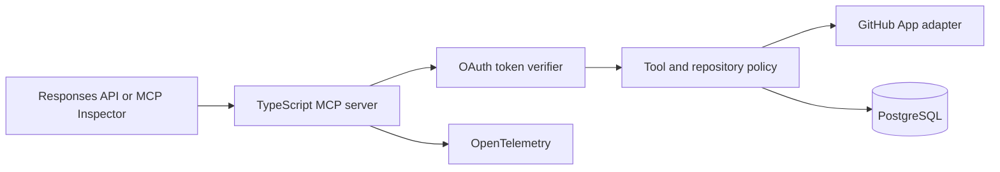

# Reference Solution — Engineering Operations MCP

Status: **implementation scaffold**

This directory will contain the reference implementation for [Project 1 — Engineering Operations MCP](../../projects/project-01-engineering-operations-mcp.md).

## Target Architecture



## Planned Implementation

- TypeScript MCP server using Streamable HTTP
- Zod input and output schemas
- GitHub App integration against an allowlisted sandbox repository
- PostgreSQL proposals, approvals, idempotency, and audit records
- Local OAuth profile for deterministic training
- Read-only recorded profile backed by fixtures
- MCP Inspector and Responses API clients
- Contract, security, integration, and evaluation tests

## Intended Structure

```text
engineering-operations-mcp/
  apps/
    mcp-server/
    approval-ui/
  packages/
    auth/
    github-adapter/
    policy/
    schemas/
    telemetry/
  migrations/
  tests/
  evals/
  fixtures/
  deploy/
  compose.yml
```

## Verification Contract

When implemented, the solution must provide commands equivalent to:

```text
start recorded environment
run preflight
list MCP tools
run contract tests
run security tests
run behavioral evaluations
reset sandbox state
```

Exact commands will be added with the implementation rather than invented before the toolchain exists.

## Design Decisions to Document

- Why each tool is narrow enough
- Why each scope is necessary
- How approval binds to the exact action
- How uncertain writes are reconciled
- What data enters model context
- What remains prototype-grade
