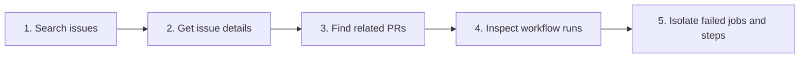

# Phase 2 Guided Walkthrough: Engineering Investigation Tools

This walkthrough teaches the Phase 2 read surface without requiring a GitHub account, credentials, AI assistance, or external documentation. The recorded fixture is synthetic, so every learner sees the same results.

> **Solution context:** this guide accompanies the reference implementation. If you are building from the project requirements, attempt your own contracts before comparing them with these examples.

## Learning objectives

By the end, you should be able to:

- explain why an MCP tool is narrower than an arbitrary GitHub API proxy;
- follow one repository policy boundary across several tools;
- distinguish search summaries from a detail projection;
- use bounded pagination without fetching indefinitely;
- normalize provider-specific workflow states;
- keep repository content in the data plane rather than treating it as instructions; and
- connect an issue, pull request, workflow run, failed job, and failed step into one investigation.

## The investigation path



Every tool follows the same server-side sequence:

1. MCP validates the declared input schema.
2. The use case validates again for callers outside MCP.
3. Repository policy checks the server-owned allowlist.
4. A deadline bounds adapter work.
5. The adapter returns a deliberately small projection.
6. The output schema verifies the response before it reaches the client.

## Start the server

From `solutions/engineering-operations-mcp`:

```bash
pnpm install --frozen-lockfile
pnpm verify
pnpm start
```

In a second terminal:

```bash
curl http://127.0.0.1:8100/health
curl http://127.0.0.1:8100/ready
pnpm inspect
```

Expected verification summary:

```text
Test Files  5 passed (5)
Tests       22 passed (22)
```

`pnpm inspect` performs one call to every read tool. For manual practice, launch MCP Inspector:

```bash
pnpm dlx @modelcontextprotocol/inspector
```

Choose **Streamable HTTP** and connect to:

```text
http://127.0.0.1:8100/mcp
```

All examples use this repository identity:

```json
{
  "owner": "acme",
  "repository": "engineering-sandbox"
}
```

## Step 1: discover the fixed tool surface

Inspector should list exactly:

```text
search_issues
get_issue
list_pull_requests
get_workflow_status
list_failed_workflow_jobs
```

Each tool should have these annotations:

- `readOnlyHint: true`
- `destructiveHint: false`
- `idempotentHint: true`
- `openWorldHint: false`

Checkpoint: explain why a tool named `github_request` with arbitrary method, URL, and body fields would violate this project's safety boundary.

## Step 2: search for the incident

Call `search_issues`:

```json
{
  "owner": "acme",
  "repository": "engineering-sandbox",
  "query": "checkout",
  "state": "open",
  "labels": [],
  "limit": 5
}
```

Expected evidence:

```json
{
  "mode": "recorded",
  "repository": "acme/engineering-sandbox",
  "query": "checkout",
  "returned": 2
}
```

The issue numbers are `101` and `102`. Search results include titles, labels, URLs, and update times, but never issue bodies. Search is for finding candidates, not placing large untrusted text into model context.

Checkpoint: change `limit` to `21`. The tool must return `INVALID_ARGUMENT` before the adapter is called.

## Step 3: retrieve selected issue details

Call `get_issue`:

```json
{
  "owner": "acme",
  "repository": "engineering-sandbox",
  "issueNumber": 101
}
```

Expected evidence:

```json
{
  "issue": {
    "number": 101,
    "state": "open",
    "author": "incident-bot",
    "commentsCount": 6,
    "contentTrust": "untrusted_repository_content"
  }
}
```

The result includes `bodyExcerpt`, not the raw backing record. The excerpt is capped at 2,000 characters and labeled so a client can preserve the boundary between instructions and repository data.

Security exercise: retrieve issue `103`. Its title and excerpt contain prompt-injection language. Verify that the content is returned as data, the tool list does not change, and no other tool runs automatically.

Not-found exercise: request issue `999`. Expected error code: `RESOURCE_NOT_FOUND` with `retryable: false`.

## Step 4: list related pull requests

Call `list_pull_requests`:

```json
{
  "owner": "acme",
  "repository": "engineering-sandbox",
  "query": "checkout",
  "state": "all",
  "page": 1,
  "pageSize": 1
}
```

Expected first page:

```json
{
  "items": [{ "number": 210, "relatedIssues": [101] }],
  "pageInfo": {
    "page": 1,
    "pageSize": 1,
    "returned": 1,
    "hasNextPage": true
  }
}
```

Because `hasNextPage` is true, repeat the call with `page: 2`. Expected second item: pull request `209`, related to issue `102`. Its `hasNextPage` value is false, so stop.

### Shared pagination rules

| Field | Default | Minimum | Maximum |
| --- | ---: | ---: | ---: |
| `page` | 1 | 1 | 10 |
| `pageSize` | 10 | 1 | 20 |

The two bounds cap one list investigation at 200 records. A client should never guess that another page exists; it should follow `hasNextPage`.

Checkpoint: use `pageSize: 21` and confirm `INVALID_ARGUMENT`. Then request a valid page beyond the available data and confirm an empty `items` array rather than an error.

## Step 5: normalize workflow status

Call `get_workflow_status`:

```json
{
  "owner": "acme",
  "repository": "engineering-sandbox",
  "workflow": "deploy-checkout",
  "status": "all",
  "page": 1,
  "pageSize": 10
}
```

Expected normalized evidence:

```json
{
  "items": [
    { "runId": 5004, "status": "failed" },
    { "runId": 5002, "status": "succeeded" }
  ],
  "pageInfo": { "returned": 2, "hasNextPage": false }
}
```

The fixture deliberately stores GitHub-shaped `status` and `conclusion` fields. The adapter maps them into one client vocabulary:

| Provider values | Tool status |
| --- | --- |
| `queued` | `queued` |
| `in_progress` | `in_progress` |
| `completed` + `success` | `succeeded` |
| `completed` + `failure` | `failed` |
| `completed` + `cancelled` | `cancelled` |

Checkpoint: filter with `status: "failed"`. Only run `5004` should remain.

## Step 6: isolate failed jobs and steps

Call `list_failed_workflow_jobs`:

```json
{
  "owner": "acme",
  "repository": "engineering-sandbox",
  "runId": 5004,
  "page": 1,
  "pageSize": 10
}
```

Expected evidence:

```json
{
  "runId": 5004,
  "items": [
    {
      "jobId": 7003,
      "name": "deploy-production",
      "status": "failed",
      "failedSteps": [
        { "number": 3, "name": "Verify checkout health", "conclusion": "failure" }
      ]
    },
    {
      "jobId": 7002,
      "name": "contract-tests",
      "status": "failed"
    }
  ]
}
```

Successful jobs and successful or skipped steps are omitted. This keeps the response focused and prevents a large workflow log from flooding model context.

Request run `5002`. It exists and succeeded, so the response contains an empty `items` array. Request run `9999`; it does not exist, so the result is `RESOURCE_NOT_FOUND`. This distinction is useful in both operator diagnostics and automated clients.

## Repository-policy failure

Call any tool with:

```json
{
  "owner": "acme",
  "repository": "private-production"
}
```

Add the other required fields for the selected tool. Expected error code: `REPOSITORY_NOT_ALLOWED`. Policy runs before the adapter, so the denied repository cannot be probed through timing or not-found differences.

## Capstone exercise

Without reading the fixture file, produce a short incident report containing:

1. the primary incident issue and its severity label;
2. the pull request most directly related to that issue;
3. the most recent failed deployment run;
4. the failed job and step most likely connected to the user-visible symptom; and
5. one sentence explaining why repository text was not treated as an instruction.

Your evidence chain should use all five tools and stop pagination whenever `hasNextPage` is false.

## Progressive hints

Use these only after attempting the exercise:

1. Search for `checkout` in open issues.
2. Issue `101` carries the incident and severity labels.
3. Pull request `210` has `relatedIssues: [101]`.
4. Filter workflow `deploy-checkout`; the newest failed run is `5004`.
5. In run `5004`, inspect job `7003` and its failed health-verification step.
6. The issue-detail response carries the trust label you should cite in the final explanation.

## Code-reading map

| Question | File or directory |
| --- | --- |
| Where are tool inputs and outputs bounded? | `src/domain/schemas.ts` |
| Where is the repository capability boundary? | `src/policy/repository-policy.ts` |
| Where are deadlines and validation errors normalized? | `src/tools/shared.ts` |
| Where does provider data become stable tool output? | `src/adapters/recorded-github-adapter.ts` |
| Where are tools declared to MCP clients? | `src/mcp/create-server.ts` |
| Where is the direct end-to-end client? | `src/inspect.ts` |
| Which tests specify expected behavior? | `tests/contract`, `tests/security`, and `tests/integration` |

## Completion checklist

- [ ] `pnpm verify` passes.
- [ ] Inspector lists exactly five read tools.
- [ ] Search returns two open checkout issues.
- [ ] Issue details carry an explicit untrusted-content label.
- [ ] Pull-request pagination stops when `hasNextPage` is false.
- [ ] Workflow provider states are normalized.
- [ ] Failed-job output excludes successful jobs and steps.
- [ ] Denied repositories never reach the adapter.
- [ ] The capstone incident report cites evidence from all five tools.

After these checks pass, the next engineering phase is replacing the recorded adapter with a GitHub App adapter while preserving these contracts and deterministic tests.
