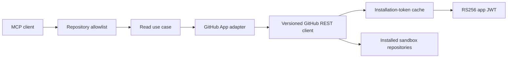

# Phase 3 Guided Walkthrough: Real GitHub App Integration

Phase 3 replaces the recorded backing service with a real GitHub App installation while preserving the five MCP tool contracts, repository allowlist, bounded pagination, and recorded-mode CI.

The GitHub App profile is read-only. It cannot create, edit, rerun, merge, or delete GitHub resources.

## Learning objectives

By the end, you should be able to:

- distinguish GitHub App identity, installation identity, and installation tokens;
- sign a bounded RS256 app JWT without exposing the private key;
- exchange the JWT for an installation token narrowed by repository and permission;
- cache and refresh an opaque one-hour installation token;
- normalize REST authentication, permission, not-found, timeout, and rate-limit failures;
- preserve the same MCP contracts across recorded and real adapters; and
- verify live issue, pull-request, workflow-run, job, and failed-step evidence.

## Architecture



The policy check happens before the adapter. A repository name appearing in a prompt never grants the App access through MCP.

## Register the GitHub App

Use a server-to-server installation App:

- leave Callback URL blank;
- disable OAuth during installation;
- disable Device Flow;
- leave Setup URL blank;
- disable webhooks; and
- select **Only on this account**.

Set exactly these repository permissions:

| Permission | Access |
| --- | --- |
| Actions | Read-only |
| Issues | Read-only |
| Metadata | Read-only |
| Pull requests | Read-only |

Leave repository administration, Contents, Workflows, organization permissions, account permissions, and event subscriptions disabled.

Install the App using **Only select repositories**, then choose a dedicated synthetic sandbox.

## Store the private key

Generate a private key from the App settings and keep the downloaded PEM outside this repository. Never paste the key into Markdown, `.env.example`, an MCP argument, a fixture, a log, or a GitHub issue.

Example Windows location:

```text
C:/Users/YOUR_USER/.config/engineering-operations-mcp/app.private-key.pem
```

The project ignores `*.pem`, `*.key`, and `.env`, but an external secret location is still required.

## Configure local GitHub App mode

Copy the example:

```bash
cp .env.example .env
```

Set these values in `.env`:

```dotenv
GITHUB_MODE=github_app
HOST=127.0.0.1
PORT=8100
ALLOWED_REPOSITORIES=YOUR_OWNER/YOUR_SANDBOX
REQUEST_TIMEOUT_MS=3000
GITHUB_APP_ID=YOUR_APP_ID
GITHUB_INSTALLATION_ID=YOUR_INSTALLATION_ID
GITHUB_PRIVATE_KEY_PATH=C:/absolute/path/outside/repository/app.private-key.pem
GITHUB_API_BASE_URL=https://api.github.com
GITHUB_API_VERSION=2026-03-10
```

The App ID and installation ID are identifiers, not bearer credentials. The PEM is the secret.

## Automated verification

```bash
pnpm install --frozen-lockfile
pnpm verify
```

Expected:

```text
Test Files  9 passed (9)
Tests       31 passed (31)
```

The suite never requires a maintainer credential. It verifies JWT signatures, token caching, opaque token formats, one-time refresh after `401`, rate-limit guidance, REST projections, recorded regressions, and MCP transport behavior through deterministic test doubles.

## Start and verify the live server

```bash
pnpm start:env
```

In another terminal:

```bash
curl http://127.0.0.1:8100/health
curl http://127.0.0.1:8100/ready
```

Expected:

```json
{"status":"ok","mode":"github_app"}
{"status":"ready"}
```

Readiness proves that the PEM was loaded, GitHub accepted the app JWT, an installation token was issued, and the installation-repositories endpoint was reachable.

## Inspect all five tools against live data

The inspection command accepts:

```text
pnpm inspect SERVER_URL OWNER REPOSITORY QUERY ISSUE_NUMBER WORKFLOW_RUN_ID
```

Example:

```bash
pnpm inspect \
  http://127.0.0.1:8100/mcp \
  YOUR_OWNER \
  YOUR_SANDBOX \
  checkout \
  1 \
  123456789
```

The output reports `isError` for every individual tool call. A successful live investigation should show:

- exactly five tool names;
- `mode: "github_app"` on every result;
- issue search results from the allowlisted sandbox;
- a bounded issue body excerpt with `contentTrust: "untrusted_repository_content"`;
- related pull-request numbers;
- normalized workflow status; and
- only failed jobs and failed steps for the selected run.

## Run live mode with Docker Compose

Docker Compose reads interpolation values from `.env`. The PEM is bind-mounted read-only at `/run/secrets/github-app.pem`; it is never copied into the image.

```bash
docker compose -f compose.yml -f compose.github-app.yml up --build --detach
docker compose -f compose.yml -f compose.github-app.yml ps
curl http://127.0.0.1:8100/ready
```

Inspect through the container using the same live arguments:

```bash
pnpm inspect http://127.0.0.1:8100/mcp YOUR_OWNER YOUR_SANDBOX checkout 1 123456789
```

Stop it:

```bash
docker compose -f compose.yml -f compose.github-app.yml down
```

## Authentication and token behavior

The implementation follows these boundaries:

1. Load the PEM once at process startup.
2. Create an RS256 JWT with `iat` 60 seconds in the past and `exp` nine minutes in the future.
3. Exchange it at `/app/installations/{installation_id}/access_tokens`.
4. Narrow the requested token to allowlisted repository names and read-only Actions, Issues, Metadata, and Pull requests permissions.
5. Treat the returned installation token as an opaque string with no fixed prefix or length.
6. Cache it until five minutes before its reported expiration.
7. On one `401`, invalidate the cache and retry once with a fresh token.
8. Never serialize tokens, JWTs, private keys, authorization headers, or raw GitHub error bodies.

## Stable live error vocabulary

| Code | Meaning | Retryable |
| --- | --- | --- |
| `UPSTREAM_AUTHENTICATION_FAILED` | App JWT or installation token rejected | no |
| `UPSTREAM_PERMISSION_DENIED` | App lacks a required repository permission | no |
| `UPSTREAM_RATE_LIMITED` | GitHub primary or secondary rate limit | yes |
| `RESOURCE_NOT_FOUND` | issue or workflow run does not exist | no |
| `UPSTREAM_TIMEOUT` | bounded request deadline exceeded | yes |
| `UPSTREAM_FAILURE` | safe normalized REST or response-contract failure | depends on status |

When available, a rate-limit error includes `retryAfterSeconds`, derived first from `Retry-After` and then from `X-RateLimit-Reset`. The server does not retry repeatedly while rate-limited.

## Troubleshooting

| Symptom | Check |
| --- | --- |
| startup says the PEM cannot be read | absolute path, filename, OS file access |
| `/health` works and `/ready` is `503` | App ID, installation ID, PEM pair, installation status |
| authentication failed | system clock, correct App private key, App ID |
| permission denied | Actions, Issues, Metadata, and Pull requests are Read-only and approved |
| repository not allowed | exact lowercase-capable `owner/repository` in `ALLOWED_REPOSITORIES` |
| search is empty | App installed on that repository; query matches real issue/PR text |
| workflow list is empty | Actions enabled and at least one run exists |
| failed jobs are empty | selected run exists but contains no job with a failed step |
| rate limited | wait for `retryAfterSeconds`; do not loop aggressively |

## Completion checklist

- [ ] Recorded mode still passes all tests without credentials.
- [ ] The App has only the four required read permissions.
- [ ] The App is installed only on a synthetic sandbox.
- [ ] The PEM remains outside the repository.
- [ ] `/ready` succeeds in `github_app` mode.
- [ ] All five tools return real sandbox evidence.
- [ ] A hostile issue remains labeled untrusted content.
- [ ] A failed workflow step is returned without successful-step noise.
- [ ] Docker mounts the PEM read-only and remains non-root/read-only.

## Official references

- [Registering a GitHub App](https://docs.github.com/en/apps/creating-github-apps/registering-a-github-app/registering-a-github-app)
- [Generating a JSON Web Token](https://docs.github.com/en/enterprise-cloud@latest/apps/creating-github-apps/authenticating-with-a-github-app/generating-a-json-web-token-jwt-for-a-github-app)
- [Generating an installation access token](https://docs.github.com/en/apps/creating-github-apps/authenticating-with-a-github-app/generating-an-installation-access-token-for-a-github-app)
- [GitHub REST API rate limits](https://docs.github.com/en/rest/using-the-rest-api/rate-limits-for-the-rest-api)
- [Workflow runs endpoints](https://docs.github.com/en/rest/actions/workflow-runs?apiVersion=2026-03-10)
- [Workflow jobs endpoints](https://docs.github.com/en/rest/actions/workflow-jobs?apiVersion=2026-03-10)
