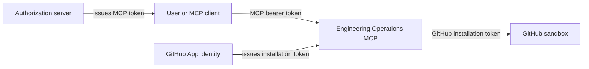
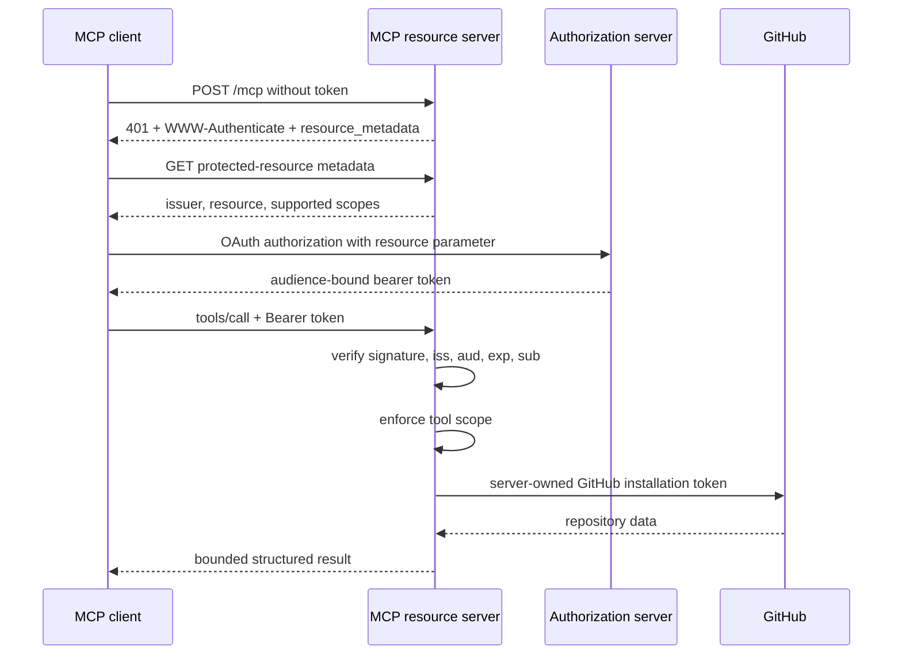

# Phase 4 — MCP Authentication and Per-Tool Authorization

Phase 4 protects the Streamable HTTP endpoint as an OAuth resource server. It
does not turn the MCP server into an authorization server. A real deployment
delegates login, consent, token issuance, and refresh to an external OAuth 2.1
or OpenID Connect provider.

## Learning outcomes

After this phase, you should be able to:

- distinguish an MCP access token from a GitHub App installation token;
- explain protected-resource metadata and authorization-server discovery;
- validate JWT signature, issuer, audience, expiration, and subject;
- enforce different scopes for different MCP tools;
- interpret `401 invalid_token` and `403 insufficient_scope` challenges; and
- test authorization without committing private keys or access tokens.

## The two-token mental model



The tokens are not interchangeable:

| Credential | Audience | Purpose | May leave the server? |
| --- | --- | --- | --- |
| MCP bearer token | MCP resource URL | authorize the client and its scopes | sent only from client to MCP server |
| GitHub installation token | GitHub API | authenticate the server's GitHub App installation | no |

Passing the user's MCP token to GitHub would be token passthrough and would
break the audience boundary. Returning the GitHub token to the client would
leak a server credential.

## Scope contract

| Tool | Required scope | Reason |
| --- | --- | --- |
| `search_issues` | `issues:read` | reads issue search results |
| `get_issue` | `issues:read` | reads issue metadata and a bounded excerpt |
| `list_pull_requests` | `repo:read` | reads repository pull-request metadata |
| `get_workflow_status` | `actions:read` | reads Actions workflow runs |
| `list_failed_workflow_jobs` | `actions:read` | reads Actions jobs and steps |

Initialization and tool discovery require a valid bearer token but do not
require every tool scope. A tool call is rejected before execution when its
specific scope is missing.

## Request sequence



## Implementation tour

Read these files in order:

1. `src/config.ts` — disabled/JWT profiles and fail-closed key-source checks.
2. `src/auth/jwt-access-token-verifier.ts` — cryptographic and claims validation.
3. `src/auth/scopes.ts` — the centralized tool-to-scope matrix.
4. `src/auth/http-authorization.ts` — metadata, bearer challenges, and HTTP scope enforcement.
5. `src/http/app.ts` — middleware ordering and public operational endpoints.
6. `src/mcp/create-server.ts` — defense-in-depth scope enforcement at the tool boundary.
7. `tests/security/jwt-access-token.test.ts` — invalid issuer, audience, expiry, and signature cases.
8. `tests/integration/authorization.test.ts` — discovery, `401`, `403`, and successful client calls.

## Verification checkpoint 1: deterministic tests

From Git Bash:

```bash
cd ~/Documents/"OpenAI Trainer Consultant"/solutions/engineering-operations-mcp
pnpm install --frozen-lockfile
pnpm verify
```

Expected summary:

```text
Test Files  11 passed (11)
Tests       45 passed (45)
```

The tests generate ephemeral keys in memory. They do not use the maintainer's
GitHub App key or require a network authorization server.

## Verification checkpoint 2: create local development keys

```bash
pnpm auth:keygen
```

This creates:

```text
.local/auth/private.pem
.local/auth/public.pem
```

`.local/` is ignored by Git and the Docker build context. The private key is a
development authorization-server stand-in; it is unrelated to the GitHub App
private key.

The command refuses to overwrite existing keys.

## Verification checkpoint 3: start the protected server

In terminal 1:

```bash
export MCP_AUTH_MODE=jwt
export MCP_RESOURCE_URL=http://127.0.0.1:8100/mcp
export MCP_AUTH_ISSUER=https://auth.example.test
export MCP_AUTH_AUDIENCE=http://127.0.0.1:8100/mcp
export MCP_AUTH_PUBLIC_KEY_PATH=.local/auth/public.pem

pnpm start
```

Expected startup fields include:

```json
{"event":"server_started","mode":"recorded","authMode":"jwt"}
```

Health and readiness remain unprotected so infrastructure can operate the
service:

```bash
curl http://127.0.0.1:8100/health
curl http://127.0.0.1:8100/ready
```

Expected:

```json
{"status":"ok","mode":"recorded","authMode":"jwt"}
{"status":"ready"}
```

## Verification checkpoint 4: inspect discovery and challenges

In terminal 2, use the same issuer and resource values:

```bash
export MCP_AUTH_ISSUER=https://auth.example.test
export MCP_RESOURCE_URL=http://127.0.0.1:8100/mcp
export MCP_AUTH_AUDIENCE=http://127.0.0.1:8100/mcp

curl http://127.0.0.1:8100/.well-known/oauth-protected-resource/mcp
```

Expected metadata includes:

```json
{
  "resource": "http://127.0.0.1:8100/mcp",
  "authorization_servers": ["https://auth.example.test/"],
  "scopes_supported": ["repo:read", "issues:read", "actions:read"],
  "bearer_methods_supported": ["header"]
}
```

Confirm that an unauthenticated MCP request receives a discovery `401`:

```bash
curl -i -X POST http://127.0.0.1:8100/mcp \
  -H 'Content-Type: application/json' \
  --data '{}'
```

Look for:

```text
HTTP/1.1 401 Unauthorized
WWW-Authenticate: Bearer resource_metadata="..." scope="..."
```

## Verification checkpoint 5: prove insufficient scope

Mint a short-lived token that can read issues but not Actions:

```bash
export MCP_ACCESS_TOKEN="$(pnpm --silent auth:token -- --scopes 'issues:read')"
```

Call an Actions tool. Authorization rejects it before MCP execution, so minimal
arguments are sufficient for this negative test:

```bash
curl -i -X POST http://127.0.0.1:8100/mcp \
  -H 'Content-Type: application/json' \
  -H "Authorization: Bearer $MCP_ACCESS_TOKEN" \
  --data '{"jsonrpc":"2.0","id":1,"method":"tools/call","params":{"name":"get_workflow_status","arguments":{}}}'
```

Expected:

```text
HTTP/1.1 403 Forbidden
WWW-Authenticate: Bearer error="insufficient_scope" ... scope="actions:read"
```

The response must not include the access token.

## Verification checkpoint 6: run the authenticated inspector

Mint the complete read token:

```bash
export MCP_ACCESS_TOKEN="$(pnpm --silent auth:token)"
pnpm inspect
```

Expected:

- `target.bearerTokenConfigured` is `true`;
- exactly five tools are listed;
- every tool has `isError: false`; and
- neither the token nor JWT claims are printed.

Tokens expire after 15 minutes by default. Mint another token when a later
request returns `401 invalid_token`.

## Docker verification

The Docker profile uses port `8114` so it can run beside earlier exercises:

```bash
pnpm auth:keygen

export MCP_HOST_PORT=8114
export MCP_AUTH_ISSUER=https://auth.example.test
export MCP_RESOURCE_URL=http://127.0.0.1:8114/mcp
export MCP_AUTH_AUDIENCE=http://127.0.0.1:8114/mcp
export MCP_ACCESS_TOKEN="$(pnpm --silent auth:token)"

docker compose -f compose.yml -f compose.auth.yml up --build --detach
curl http://127.0.0.1:8114/ready
pnpm inspect http://127.0.0.1:8114/mcp
docker compose -f compose.yml -f compose.auth.yml down
```

The container receives only the public verification key, mounted read-only.
The local signing key is never copied or mounted into the MCP server.

To combine live GitHub reads with inbound MCP authorization, layer all three
profiles:

```bash
docker compose \
  -f compose.yml \
  -f compose.github-app.yml \
  -f compose.auth.yml \
  up --build --detach
```

## Production boundary

The local key and token scripts teach resource-server mechanics; they are not
an OAuth authorization server. A hosted deployment must:

- use HTTPS for the MCP resource and authorization server;
- configure `MCP_AUTH_JWKS_URL` from a trusted issuer instead of a local key;
- rely on the issuer's OAuth/OIDC discovery, login, consent, PKCE, refresh, and revocation;
- request the MCP resource indicator when obtaining tokens;
- keep access tokens out of URLs, logs, traces, and tool arguments; and
- retain the server-side GitHub App credential boundary.

## Break/fix exercises

1. Mint a token with the wrong audience. Record its `401 invalid_token` response.
2. Mint a one-second token, wait, and confirm expiration is rejected.
3. Request `search_issues` with only `actions:read`; identify the required scope.
4. Change the configured issuer without minting a new token; explain the failure.
5. Configure both a JWKS URL and public-key path; confirm startup fails closed.
6. Remove the bearer header from one inspector request and confirm the MCP
   session does not make later requests trusted automatically.

## Hints

<details>
<summary>Why does the issuer include a trailing slash?</summary>

The local issuer is normalized as a URL. JWT issuer matching is exact, so the
token helper performs the same URL normalization as the server.
</details>

<details>
<summary>Why does an issue-only token fail midway through `pnpm inspect`?</summary>

The inspector intentionally exercises all five tools. Its pull-request and
Actions calls require scopes the issue-only token does not contain. Use the
focused `curl` example for a predictable negative test.
</details>

<details>
<summary>Why are health and readiness public?</summary>

Load balancers and container orchestrators need non-sensitive operational
signals without user tokens. These endpoints expose no repository data or MCP
tool capabilities.
</details>

## Review questions

1. Why is validating only a JWT signature insufficient?
2. What attack does audience validation prevent?
3. Why is `403` used for a valid token with missing scope?
4. Why should the metadata endpoint be available before authentication?
5. Where is the primary scope check, and where is the defense-in-depth check?
6. Why must the GitHub installation token never be used as the MCP bearer token?

## Completion evidence

Capture the following without copying any token or private-key content:

- the `pnpm verify` summary;
- the protected-resource metadata response;
- one missing-credential `401` discovery challenge and one invalid-token challenge;
- one `403 insufficient_scope` challenge showing `actions:read`;
- the authenticated inspector result with five successful tools; and
- Docker readiness plus the read-only public-key mount.
