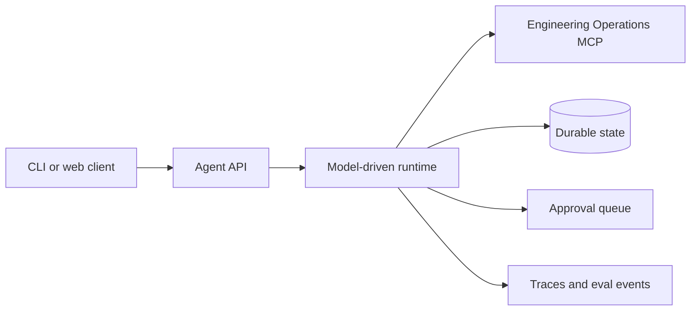

# Reference Solution — Reliable Agent Runtime

Status: **implementation scaffold**

This directory will contain the reference implementation for [Project 2 — Reliable Agent Runtime](../../projects/project-02-reliable-agent-runtime.md).

## Target Architecture



## Planned Implementation

- Model-driven tool routing
- Durable event and state storage
- Approval pause and resume
- Input, tool, and output guardrails
- Cancellation, timeout, and call limits
- Recorded run replay
- Trace export and correlation
- At least 30 workflow evaluation cases

## Intended Structure

```text
reliable-agent-runtime/
  src/
    api/
    runtime/
    state/
    guardrails/
    approvals/
    telemetry/
  migrations/
  tests/
  evals/
  fixtures/
  docs/
```

## Dependency Boundary

This solution will consume the MCP server through its protocol contract. It must not import internal GitHub adapter or policy implementation modules from the MCP solution.

## Design Decisions to Document

- State machine and terminal outcomes
- Concurrency strategy
- Retry classification
- Approval and replay protection
- Trace redaction
- Deterministic versus subjective graders
