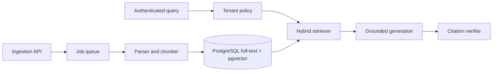

# Reference Solution — Tenant-Aware RAG Platform

Status: **implementation scaffold**

This directory will contain the reference implementation for [Project 3 — Tenant-Aware RAG Platform](../../projects/project-03-tenant-aware-rag-platform.md).

## Target Architecture



## Planned Implementation

- Asynchronous ingestion and visible job status
- Stable document identity and version replacement
- PostgreSQL full-text and vector search
- Rank-fusion hybrid retrieval
- Tenant and permission filtering in every retrieval path
- Grounded answer schema and citation verification
- Recorded and live generation modes
- Retrieval and answer evaluation reports

## Intended Structure

```text
tenant-aware-rag-platform/
  apps/
    ingestion-api/
    query-api/
    worker/
  packages/
    documents/
    retrieval/
    policy/
    generation/
    evaluation/
  migrations/
  corpus/
  tests/
  evals/
  reports/
  compose.yml
```

## Design Decisions to Document

- Document identity and deletion semantics
- Chunking strategy by document type
- Hybrid scoring method
- Permission-filter placement
- Citation stability
- Evaluation thresholds
